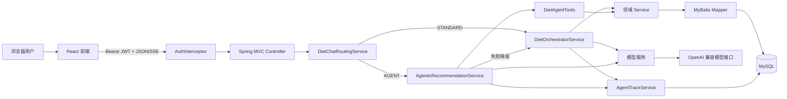
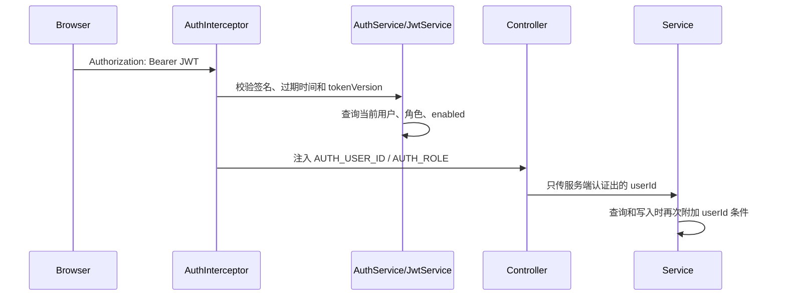
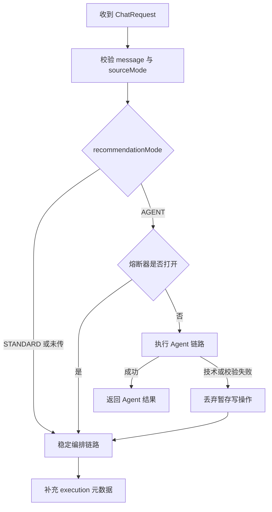
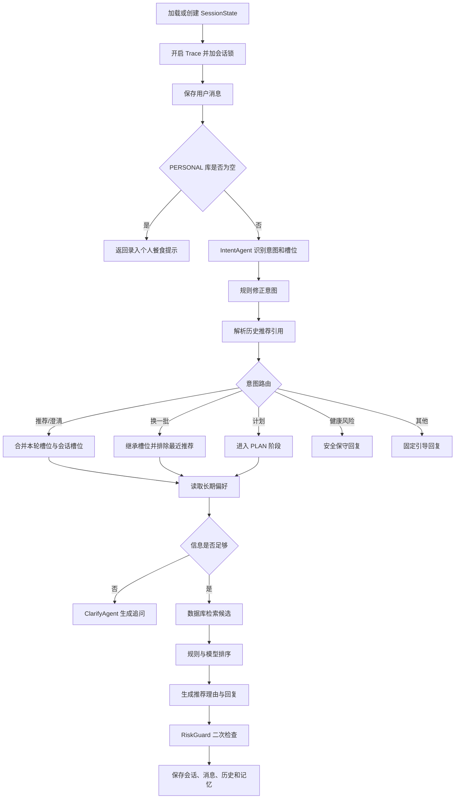
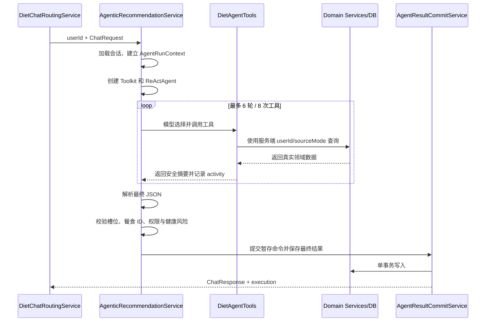
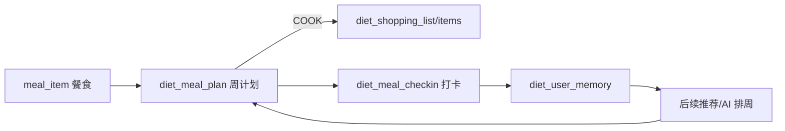

# 食刻（diet-agent）项目架构与核心链路

本文档面向需要理解、维护或继续扩展本项目的开发者，描述当前代码中的整体架构、核心业务链路、数据模型、安全边界，以及各模块对应的代码位置。

## 1. 项目定位

食刻是一个前后端分离的日常饮食助手。它不只回答“今天吃什么”，还将推荐结果连接到一周计划、购物清单、执行打卡、长期记忆和每周复盘，形成如下闭环：

```text
自然语言推荐
    ↓
加入一周计划
    ↓
生成购物清单 / 查看外食建议
    ↓
今日执行与打卡
    ↓
反馈进入长期记忆
    ↓
影响后续推荐和下周计划
```

推荐能力包含两条链路：

- `STANDARD`：稳定、确定的固定编排链路。
- `AGENT`：使用 ReAct Agent 和受控站内工具的智能链路；失败时自动降级到 `STANDARD`。

## 2. 技术栈

| 层级 | 技术 |
| --- | --- |
| 前端 | React、TypeScript、Vite、React Router、Lucide React |
| 后端 | Spring Boot 3、Java、MyBatis |
| Agent | AgentScope Java 1.0.11、ReActAgent、Toolkit |
| 数据库 | MySQL 8；测试使用 H2 |
| 鉴权 | JWT Bearer Token、BCrypt |
| 通信 | JSON HTTP API、SSE 流式响应 |
| 测试 | JUnit 5、Mockito、Spring MockMvc、Vitest、Testing Library、jsdom |

依赖声明位于：

- 后端：[pom.xml](../diet-agent/pom.xml)
- 前端：[package.json](../diet-web/package.json)

## 3. 仓库结构

```text
diet-agent/
├─ diet-agent/                       Spring Boot 后端
│  ├─ src/main/java/com/diet/
│  │  ├─ controller/                 HTTP 接口层
│  │  ├─ service/                    业务与 Agent 编排层
│  │  ├─ agent/                      固定链路 Agent 构造器和工厂
│  │  ├─ mapper/                     MyBatis Mapper 接口
│  │  ├─ model/                      请求、响应、数据库行和领域模型
│  │  ├─ enums/                      业务枚举
│  │  ├─ config/                     JWT、CORS、管理员权限等配置
│  │  └─ util/                       JSON 与槽位工具
│  └─ src/main/resources/
│     ├─ mapper/                     MyBatis SQL XML
│     ├─ diet/prompts/               Agent 提示词
│     └─ db/                         完整建库脚本与增量迁移
├─ diet-web/                         React 前端
│  └─ src/
│     ├─ pages/                      页面
│     ├─ components/                 通用组件
│     ├─ lib/                        API 与认证上下文
│     ├─ types.ts                    前端领域类型
│     └─ styles.css                  全局样式
├─ docs/                             项目文档与设计素材
└─ README.md                         启动和使用说明
```

## 4. 总体架构



主要入口：

- 后端启动类：[DietApplication.java](../diet-agent/src/main/java/com/diet/DietApplication.java)
- 前端路由：[App.tsx](../diet-web/src/App.tsx)
- API 封装：[api.ts](../diet-web/src/lib/api.ts)
- 对话 HTTP 入口：[DietChatController.java](../diet-agent/src/main/java/com/diet/controller/chat/DietChatController.java)

## 5. 请求身份与权限链路

除注册和登录外，业务接口都使用 JWT 获取当前用户身份，不接受前端自行声明 `userId`。



对应代码：

- JWT 生成与校验：[JwtService.java](../diet-agent/src/main/java/com/diet/service/auth/JwtService.java)
- 注册、登录、注销和用户校验：[AuthService.java](../diet-agent/src/main/java/com/diet/service/auth/AuthService.java)
- 请求拦截：[AuthInterceptor.java](../diet-agent/src/main/java/com/diet/config/AuthInterceptor.java)
- MVC 注册：[AuthMvcConfig.java](../diet-agent/src/main/java/com/diet/config/AuthMvcConfig.java)
- 管理员注解：[AdminOnly.java](../diet-agent/src/main/java/com/diet/config/AdminOnly.java)
- 前端登录态：[AuthContext.tsx](../diet-web/src/lib/AuthContext.tsx)

权限规则：

- 普通用户只能操作自己的个人餐食、计划、购物清单、记忆、收藏和打卡。
- 公共餐食对普通用户只读，只有管理员可以单条或批量维护。
- 模型配置、运行记录和离线评测只对管理员开放。
- Agent 工具中的 `userId` 和 `sourceMode` 由服务端上下文注入，不允许模型传入。

## 6. 对话协议与统一路由

同步和流式接口分别是：

- `POST /api/v1/diet/chat`
- `POST /api/v1/diet/chat/stream`

请求结构定义在 [ChatRequest.java](../diet-agent/src/main/java/com/diet/model/ChatRequest.java)：

```json
{
  "sessionId": "可选",
  "message": "推荐一道适合明天午餐的菜并加入计划",
  "sourceMode": "PUBLIC",
  "recommendationMode": "AGENT",
  "context": {}
}
```

其中：

- `sourceMode`：`PERSONAL` 或 `PUBLIC`，是严格数据源边界。
- `recommendationMode`：`STANDARD` 或 `AGENT`；省略时默认为 `STANDARD`。
- 同一会话可以在两种推荐模式之间切换。

统一路由由 [DietChatRoutingService.java](../diet-agent/src/main/java/com/diet/service/orchestrator/DietChatRoutingService.java) 完成：



响应中的执行信息定义在 [ChatExecution.java](../diet-agent/src/main/java/com/diet/model/ChatExecution.java)：

```json
{
  "requestedMode": "AGENT",
  "actualMode": "STANDARD",
  "fallbackOccurred": true,
  "fallbackCode": "AGENT_TIMEOUT",
  "activities": [],
  "mutationsCommitted": false
}
```

SSE 事件定义在 [ChatStreamEvent.java](../diet-agent/src/main/java/com/diet/model/ChatStreamEvent.java)，事件顺序通常为：

```text
status → activity（0~N 次）→ status（可能为降级提示）→ delta（0~N 次）→ complete
```

异常时发送 `error`。

## 7. STANDARD 稳定推荐链路

稳定链路入口是 [DietOrchestratorService.java](../diet-agent/src/main/java/com/diet/service/orchestrator/DietOrchestratorService.java) 的 `dietChat`。



### 7.1 意图识别

- 模型识别：[IntentAgentService.java](../diet-agent/src/main/java/com/diet/service/intent/IntentAgentService.java)
- 规则修正：[IntentReviseService.java](../diet-agent/src/main/java/com/diet/service/intent/IntentReviseService.java)
- Agent 构造：[IntentAgentBuilder.java](../diet-agent/src/main/java/com/diet/agent/builder/IntentAgentBuilder.java)
- 提示词：[intent.txt](../diet-agent/src/main/resources/diet/prompts/intent.txt)

主要意图定义在 [Intent.java](../diet-agent/src/main/java/com/diet/enums/Intent.java)，包括推荐、澄清、调整、计划、健康风险和其他。

### 7.2 槽位与澄清

餐食需求统一表示为 `SlotBundle`，包含：

- `mealTime`：餐次。
- `mood`：情绪或状态。
- `scene`：使用场景。
- `healthGoal`：健康目标。
- `cuisine`：菜系。
- `taste`：口味。
- `convenience`：便捷性要求。

对应代码：

- 槽位模型：[SlotBundle.java](../diet-agent/src/main/java/com/diet/model/SlotBundle.java)
- 多轮合并：[SlotMergeService.java](../diet-agent/src/main/java/com/diet/service/slot/SlotMergeService.java)
- 合法值校验：[SlotOptionService.java](../diet-agent/src/main/java/com/diet/service/slot/SlotOptionService.java)
- 规则判断：[ClarifyRuleService.java](../diet-agent/src/main/java/com/diet/service/clarify/ClarifyRuleService.java)
- 澄清回复：[ClarifyAgentService.java](../diet-agent/src/main/java/com/diet/service/clarify/ClarifyAgentService.java)

### 7.3 检索、排序与回复

- 餐食查询：[MealSearchService.java](../diet-agent/src/main/java/com/diet/service/meal/MealSearchService.java)
- 餐食排序：[MealRankService.java](../diet-agent/src/main/java/com/diet/service/meal/MealRankService.java)
- 推荐文本生成：[RecommendResponseAgentService.java](../diet-agent/src/main/java/com/diet/service/recommend/RecommendResponseAgentService.java)
- 健康风险检查：[RiskGuardService.java](../diet-agent/src/main/java/com/diet/service/risk/RiskGuardService.java)
- 餐食数据库服务：[MealService.java](../diet-agent/src/main/java/com/diet/service/meal/MealService.java)

模型只负责理解、排序建议和自然语言表达；最终展示的餐食卡片仍从数据库中的真实餐食生成。

## 8. AGENT 智能推荐链路

Agent 链路入口是 [AgenticRecommendationService.java](../diet-agent/src/main/java/com/diet/service/agentic/AgenticRecommendationService.java)。每轮请求都会创建一个独立 `ReActAgent`：

- 使用主模型。
- `maxIters = 6`。
- 默认总超时 20 秒，可通过 `diet.agentic.timeout-seconds` 调整。
- 单轮最多调用 8 次工具。
- 最终只接受结构化 JSON。

系统提示词位于 [agentic-recommendation.txt](../diet-agent/src/main/resources/diet/prompts/agentic-recommendation.txt)。



### 8.1 Agent 工具

工具集中定义在 [DietAgentTools.java](../diet-agent/src/main/java/com/diet/service/agentic/DietAgentTools.java)，由 [DietAgentToolsFactory.java](../diet-agent/src/main/java/com/diet/service/agentic/DietAgentToolsFactory.java) 注入本轮上下文。

| 工具 | 类型 | 作用 |
| --- | --- | --- |
| `search_meals` | 只读 | 在当前数据源内按餐次、获取方式、耗时、价格等过滤餐食 |
| `get_meal_detail` | 只读 | 查看本轮已经检索到的餐食详情 |
| `get_user_diet_context` | 只读 | 读取长期偏好、行为约束和不喜欢的餐食 |
| `get_recent_recommendations` | 只读 | 查询近期推荐，减少重复 |
| `get_week_plan` | 只读 | 查看当前用户周计划 |
| `get_shopping_list` | 只读 | 查看当前用户购物清单 |
| `add_or_replace_plan_item` | 暂存写入 | 暂存加入或覆盖指定日期餐次的计划 |
| `replace_plan_item` | 暂存写入 | 暂存替换一个已有计划项 |
| `sync_shopping_list` | 暂存写入 | 暂存同步某周购物清单 |

工具安全上下文位于 [AgentRunContext.java](../diet-agent/src/main/java/com/diet/service/agentic/AgentRunContext.java)，负责：

- 保存认证后的 `userId` 和当前 `sourceMode`。
- 统计工具调用次数。
- 记录本轮真实检索过的餐食 ID。
- 收集可以展示给前端的活动摘要。
- 保存尚未提交的写命令。

### 8.2 餐食 ID 防编造

Agent 返回餐食卡片前必须经过两层校验：

1. ID 必须由本轮 `search_meals` 返回并记录在 `AgentRunContext`。
2. `MealService.findAccessibleMeal` 必须确认当前用户有权访问，且餐食属于当前 `sourceMode`。

最终卡片由服务端从数据库重新构造，模型生成的名称、价格、食材或营养内容不会直接成为可信数据。

### 8.3 写操作策略与事务提交

写操作权限不是只靠提示词控制。规则实现位于 [AgentMutationPolicy.java](../diet-agent/src/main/java/com/diet/service/agentic/AgentMutationPolicy.java)：

- “这道不错”不会触发写入。
- “把它加入明天午餐计划”可以触发计划写入。
- “同步本周购物清单”可以触发清单同步。

Agent 工具只生成 [AgentMutation.java](../diet-agent/src/main/java/com/diet/service/agentic/AgentMutation.java) 中的待提交命令，不立即写数据库。

提交阶段：

- 命令执行：[AgentMutationCommitService.java](../diet-agent/src/main/java/com/diet/service/agentic/AgentMutationCommitService.java)
- 最终结果、会话、消息、历史和记忆提交：[AgentResultCommitService.java](../diet-agent/src/main/java/com/diet/service/agentic/AgentResultCommitService.java)

`AgentResultCommitService.commit` 使用事务；任何一步失败都会回滚。如果 Agent 在提交前超时、报错或输出非法，暂存命令会随本轮上下文直接丢弃。

### 8.4 降级与熔断

Agent 失败通过 [AgentRunException.java](../diet-agent/src/main/java/com/diet/service/agentic/AgentRunException.java) 携带：

- 降级代码。
- 已完成的安全活动摘要。
- 工具调用次数。
- 本轮是否包含明确写操作。

典型降级代码包括：

- `AGENT_TIMEOUT`
- `MODEL_ERROR`
- `TOOL_ERROR`
- `TOOL_CALL_UNSUPPORTED`
- `INVALID_OUTPUT`
- `UNVERIFIED_MEAL_ID`
- `POLICY_VIOLATION`
- `AGENT_CIRCUIT_OPEN`

熔断器实现位于 [AgentCircuitBreaker.java](../diet-agent/src/main/java/com/diet/service/agentic/AgentCircuitBreaker.java)：连续 3 次基础设施类失败后暂停 Agent 链路 60 秒；一次成功调用或模型配置更新会重置熔断状态。

降级时：

- 已暂存命令不提交。
- 稳定链路正常生成回复。
- 用户消息和最终助手消息只由稳定链路保存一次。
- 前端根据 `execution.fallbackOccurred` 和 `NOT_COMMITTED` 活动显示提示。

当前实现会分别保存失败的 Agent 尝试 Trace 和随后稳定链路的 Trace；两者可通过同一会话和相近时间定位。目前没有额外的 `parentTraceId` 字段。

## 9. 会话、推荐历史与长期记忆

### 9.1 会话状态

会话状态保存在 `diet_sessions`，消息保存在 `diet_messages`。

- 会话操作：[SessionService.java](../diet-agent/src/main/java/com/diet/service/session/SessionService.java)
- 状态加载与保存：[SessionStateService.java](../diet-agent/src/main/java/com/diet/service/session/SessionStateService.java)
- 状态模型：[SessionState.java](../diet-agent/src/main/java/com/diet/model/SessionState.java)
- 数据访问：[SessionMapper.xml](../diet-agent/src/main/resources/mapper/SessionMapper.xml)

`SessionState` 记录当前意图、阶段、已解析槽位、数据源和最近推荐 ID，使普通链路与 Agent 链路能够共享同一会话。

### 9.2 推荐历史

真正展示给用户的推荐写入 `diet_recommendation_history`：

- 服务：[RecommendationHistoryService.java](../diet-agent/src/main/java/com/diet/service/history/RecommendationHistoryService.java)
- Controller：[RecommendationHistoryController.java](../diet-agent/src/main/java/com/diet/controller/history/RecommendationHistoryController.java)
- Mapper：[RecommendationHistoryMapper.xml](../diet-agent/src/main/resources/mapper/RecommendationHistoryMapper.xml)

历史不仅用于展示，也支持“上次那个”“类似的再来一道”等跨对话引用。

### 9.3 长期记忆

长期记忆保存在 `diet_user_memory`：

- 服务：[UserMemoryService.java](../diet-agent/src/main/java/com/diet/service/memory/UserMemoryService.java)
- Controller：[UserMemoryController.java](../diet-agent/src/main/java/com/diet/controller/memory/UserMemoryController.java)
- Mapper：[UserMemoryMapper.xml](../diet-agent/src/main/resources/mapper/UserMemoryMapper.xml)

记忆来源包括：

- 用户在对话中明确表达的口味、菜系、健康目标和便捷性要求。
- 收藏与喜欢反馈。
- 不喜欢和低评分反馈。
- 打卡、跳过及“太贵”“太费时间”“吃不饱”等原因。

推荐时，本轮明确条件优先于长期偏好；明确不喜欢的餐食会进入排除集合。

## 10. 餐食、计划、购物和打卡闭环



### 10.1 餐食库

餐食由基础标签和详情两部分组成：

- 基础标签：餐次、场景、健康目标、菜系、口味、便捷性等。
- 详情：获取方式、预计耗时、难度、价格、默认份数、食材、步骤、外食建议、替换菜品和营养摘要。

代码位置：

- Controller：[MealController.java](../diet-agent/src/main/java/com/diet/controller/meal/MealController.java)
- Service：[MealService.java](../diet-agent/src/main/java/com/diet/service/meal/MealService.java)
- AI 补全与个人库扩展：[MealAiService.java](../diet-agent/src/main/java/com/diet/service/meal/MealAiService.java)
- 领域模型：[MealItem.java](../diet-agent/src/main/java/com/diet/model/MealItem.java)、[MealDetail.java](../diet-agent/src/main/java/com/diet/model/MealDetail.java)
- Mapper：[MealMapper.xml](../diet-agent/src/main/resources/mapper/MealMapper.xml)
- 前端餐食库：[MealsPage.tsx](../diet-web/src/pages/MealsPage.tsx)
- 前端详情页：[MealDetailPage.tsx](../diet-web/src/pages/MealDetailPage.tsx)

### 10.2 一周计划

计划以 `user_id + plan_date + meal_period` 唯一，同一用户同一天同一餐次只有一道主餐。保存时写入餐食快照，餐食库后续修改不会影响已经形成的历史计划。

- Controller：[MealPlanController.java](../diet-agent/src/main/java/com/diet/controller/plan/MealPlanController.java)
- Service：[MealPlanService.java](../diet-agent/src/main/java/com/diet/service/plan/MealPlanService.java)
- Mapper：[MealPlanMapper.xml](../diet-agent/src/main/resources/mapper/MealPlanMapper.xml)
- 前端：[PlanPage.tsx](../diet-web/src/pages/PlanPage.tsx)
- 加入计划弹窗：[AddToPlanDialog.tsx](../diet-web/src/components/AddToPlanDialog.tsx)
- 任意餐食选择：[MealPickerDialog.tsx](../diet-web/src/components/MealPickerDialog.tsx)

`MealPlanService` 同时负责：查询周计划、添加或覆盖、更新、删除、AI 排周、相似替换、打卡和周报统计。

### 10.3 购物清单

购物清单只聚合计划中获取方式为 `COOK` 的餐食：

- 相同食材且单位相同才合并。
- 不同单位不自动换算。
- 手工项和自动项分开处理。
- 重新同步自动项时不会删除手工项。

代码位置：

- Controller：[ShoppingListController.java](../diet-agent/src/main/java/com/diet/controller/shopping/ShoppingListController.java)
- Service：[ShoppingListService.java](../diet-agent/src/main/java/com/diet/service/shopping/ShoppingListService.java)
- Mapper：[ShoppingListMapper.xml](../diet-agent/src/main/resources/mapper/ShoppingListMapper.xml)
- 前端：[ShoppingPage.tsx](../diet-web/src/pages/ShoppingPage.tsx)

### 10.4 今日执行、打卡和周报

打卡写入 `diet_meal_checkin`，并更新计划状态：

- `PLANNED`
- `COMPLETED`
- `SKIPPED`
- `REPLACED`

评分、饱腹感、原因、实际餐食、实际花费和备注由 `MealPlanService.checkIn` 处理，同时调用 `UserMemoryService.rememberPlanOutcome` 更新长期行为约束。

周报由 `MealPlanService.weeklySummary` 统计完成率、做饭/外食比例、偏好标签、常见餐食和费用。

## 11. 收藏与反馈链路

推荐卡片上的行为通过以下服务进入长期画像：

- 收藏：[FavoriteMealService.java](../diet-agent/src/main/java/com/diet/service/favorite/FavoriteMealService.java)
- 推荐反馈：[FeedbackService.java](../diet-agent/src/main/java/com/diet/service/feedback/FeedbackService.java)
- 收藏接口：[FavoriteMealController.java](../diet-agent/src/main/java/com/diet/controller/favorite/FavoriteMealController.java)
- 反馈接口：[FeedbackController.java](../diet-agent/src/main/java/com/diet/controller/feedback/FeedbackController.java)

前端相关页面和组件：

- 首页推荐与今日执行：[ChatPage.tsx](../diet-web/src/pages/ChatPage.tsx)
- 收藏和历史：[CollectionPage.tsx](../diet-web/src/pages/CollectionPage.tsx)
- 长期偏好：[PreferencesPage.tsx](../diet-web/src/pages/PreferencesPage.tsx)
- 餐食卡片：[MealCard.tsx](../diet-web/src/components/MealCard.tsx)

## 12. 模型配置

模型配置保存在 `diet_model_config`，支持多个 OpenAI 兼容服务模板，也允许自定义 Base URL、Endpoint、主模型和轻量模型。

- Controller：[ModelConfigController.java](../diet-agent/src/main/java/com/diet/controller/model/ModelConfigController.java)
- Service：[ModelConfigService.java](../diet-agent/src/main/java/com/diet/service/model/ModelConfigService.java)
- Mapper：[ModelConfigMapper.xml](../diet-agent/src/main/resources/mapper/ModelConfigMapper.xml)
- 前端：[ModelSettingsPage.tsx](../diet-web/src/pages/ModelSettingsPage.tsx)

模型职责：

- 主模型：智能 Agent、主要推荐生成等复杂任务。
- 轻量模型：意图识别、澄清等较轻任务。

连接测试分两步：

1. 验证普通文本调用。
2. 注册一个临时 `diet_echo` 工具，验证模型是否能实际发起工具调用。

保存新配置会发布 [ModelConfigChangedEvent.java](../diet-agent/src/main/java/com/diet/service/model/ModelConfigChangedEvent.java)，清理固定 Agent 缓存并重置智能链路熔断器。

## 13. Trace、运行记录与评测

Trace 由 [AgentTraceService.java](../diet-agent/src/main/java/com/diet/service/trace/AgentTraceService.java) 记录到 `diet_request_trace`。

重要字段：

- `requested_mode`：用户请求的推荐模式。
- `actual_mode`：最终执行模式。
- `fallback_code`：降级原因。
- `tool_call_count`：工具调用数。
- `trace_json`：有序事件列表。
- `duration_ms`：链路耗时。

典型 Agent 事件：

- `AGENT_STARTED`
- `AGENT_CALL`
- `TOOL_CALLED`
- `TOOL_RESULT`
- `ACTION_STAGED`
- `ACTION_COMMITTED`
- `AGENT_FALLBACK`

代码位置：

- Trace Controller：[AgentTraceController.java](../diet-agent/src/main/java/com/diet/controller/trace/AgentTraceController.java)
- Trace Mapper：[AgentTraceMapper.xml](../diet-agent/src/main/resources/mapper/AgentTraceMapper.xml)
- 运行记录页面：[TracesPage.tsx](../diet-web/src/pages/TracesPage.tsx)
- 离线评测：[EvaluationService.java](../diet-agent/src/main/java/com/diet/service/evaluation/EvaluationService.java)
- LLM Judge：[EvaluationJudgeService.java](../diet-agent/src/main/java/com/diet/service/evaluation/EvaluationJudgeService.java)
- 评测页面：[EvaluationsPage.tsx](../diet-web/src/pages/EvaluationsPage.tsx)

运行记录页会区分 Agent 成功率、降级率、平均工具调用数，以及 Agent 和稳定链路的平均耗时。

## 14. 前端页面架构

前端路由统一定义在 [App.tsx](../diet-web/src/App.tsx)：

| 路由 | 页面 | 作用 |
| --- | --- | --- |
| `/` | `ChatPage` | 推荐对话、智能开关、今日计划、推荐历史和记忆摘要 |
| `/meals/personal` | `MealsPage` | 个人餐食库维护 |
| `/meals/public` | `MealsPage` | 公共餐食库；普通用户只读，管理员可维护 |
| `/meals/:id` | `MealDetailPage` | 餐食详情、食材步骤和加入计划 |
| `/collection` | `CollectionPage` | 收藏与推荐历史 |
| `/plan` | `PlanPage` | 周计划、替换、拖动、打卡和周报 |
| `/shopping` | `ShoppingPage` | 购物清单同步和手工维护 |
| `/preferences` | `PreferencesPage` | 长期偏好维护 |
| `/traces` | `TracesPage` | 管理员运行记录与人工标注 |
| `/evaluations` | `EvaluationsPage` | 管理员离线评测 |
| `/settings/models` | `ModelSettingsPage` | 管理员模型配置 |

对话页的智能模式状态保存在浏览器键 `diet.smart-recommendation.v1`。请求执行期间，数据源和智能模式开关都会被禁用，避免同一轮请求上下文发生变化。

## 15. 数据库表与代码映射

完整结构位于 [diet_db.sql](../diet-agent/src/main/resources/db/diet_db.sql)。

| 表 | 作用 | 主要 Mapper/Service |
| --- | --- | --- |
| `diet_user` | 用户、角色、令牌版本 | `DietUserMapper` / `AuthService` |
| `diet_sessions` | 会话状态 | `SessionMapper` / `SessionStateService` |
| `diet_messages` | 用户和助手消息 | `SessionMapper` / `SessionService` |
| `diet_request_trace` | 链路追踪和人工标注 | `AgentTraceMapper` / `AgentTraceService` |
| `diet_slot_option` | 合法槽位枚举 | `SlotOptionMapper` / `SlotOptionService` |
| `meal_item` | 公共和个人餐食 | `MealMapper` / `MealService` |
| `diet_model_config` | 模型服务配置 | `ModelConfigMapper` / `ModelConfigService` |
| `diet_recommendation_history` | 用户看到的推荐历史 | `RecommendationHistoryMapper` / `RecommendationHistoryService` |
| `diet_user_memory` | 长期偏好和行为约束 | `UserMemoryMapper` / `UserMemoryService` |
| `diet_favorite_meal` | 收藏 | `FavoriteMealMapper` / `FavoriteMealService` |
| `diet_meal_plan` | 周计划与餐食快照 | `MealPlanMapper` / `MealPlanService` |
| `diet_meal_checkin` | 计划执行打卡 | `MealPlanMapper` / `MealPlanService` |
| `diet_shopping_list` | 每周购物清单头 | `ShoppingListMapper` / `ShoppingListService` |
| `diet_shopping_item` | 自动和手工购物项 | `ShoppingListMapper` / `ShoppingListService` |
| `recommend_feedback` | 推荐喜欢/不喜欢反馈 | `FeedbackMapper` / `FeedbackService` |

已有数据库需要按时间顺序执行 `diet-agent/src/main/resources/db/migrations/` 中的迁移。双链路功能对应 [20260921_agentic_recommendation.sql](../diet-agent/src/main/resources/db/migrations/20260921_agentic_recommendation.sql)。

## 16. 主要 API 分组

所有业务 API 的统一前缀是 `/api/v1/diet`。

| 分组 | 主要接口 |
| --- | --- |
| 认证 | `/auth/register`、`/auth/login`、`/auth/me`、`/auth/logout` |
| 推荐 | `/chat`、`/chat/stream` |
| 餐食 | `/meals/personal`、`/meals/public`、`/meals/{id}`、`/meals/ai/complete` |
| 计划 | `/plans`、`/plans/items`、`/plans/generate`、`/plans/items/{id}/replace`、`/check-in` |
| 购物清单 | `/shopping-lists`、`/shopping-lists/sync`、`/shopping-lists/items` |
| 记忆与历史 | `/memories`、`/memories/preferences`、`/recommendations/history` |
| 收藏与反馈 | `/favorites`、`/feedback` |
| 模型配置 | `/model-config`、`/model-config/test` |
| 可观测性 | `/debug/traces`、`/evaluations` |

Controller 的完整列表位于 [controller](../diet-agent/src/main/java/com/diet/controller/)；前端调用封装位于 [api.ts](../diet-web/src/lib/api.ts)。

## 17. 测试结构

后端测试位于 [src/test/java](../diet-agent/src/test/java/)，主要覆盖：

- JWT 与角色权限。
- 用户数据隔离。
- 公共餐食批量事务。
- 推荐历史、收藏和长期记忆。
- 日常计划、购物清单和打卡 HTTP 集成。
- Agent 路由、自动降级和熔断。
- Agent 写操作意图判断、命令暂存和数据源隔离。

前端测试位于 `diet-web/src/__tests__/`：

- 登录、退出和管理员页面权限。
- API Bearer Token 与请求路径。
- 计划、打卡和购物清单交互。
- 餐食详情编辑器。
- 智能模式开关、请求协议、Agent 活动和降级提示。

运行命令：

```bash
cd diet-agent
mvn test

cd ../diet-web
npm test
npm run build
```

## 18. 扩展新功能时的落点

### 新增一个普通业务能力

建议依次增加：

1. `model` 中的请求、响应和行模型。
2. `mapper` 接口与 XML SQL。
3. `service` 中的事务和权限逻辑。
4. `controller` 中的 HTTP 接口。
5. `diet-web/src/types.ts` 和 `lib/api.ts`。
6. 对应页面或组件。
7. 后端权限/事务测试和前端交互测试。

### 新增一个 Agent 只读工具

1. 在 `DietAgentTools` 中添加带 `@Tool` 的方法。
2. 从 `AgentRunContext` 读取 `userId` 和 `sourceMode`，不要把它们暴露成模型参数。
3. 调用已有领域 Service，不直接执行任意 SQL。
4. 返回有限且结构化的数据，并记录安全的 `AgentActivity`。
5. 增加用户隔离、数据源隔离和调用次数测试。

### 新增一个 Agent 写工具

除上述步骤外，还必须：

1. 在 `AgentMutationPolicy` 中增加确定性的显式意图规则。
2. 在 `AgentMutation` 中定义待提交命令。
3. 工具阶段只调用 `context.stage`，禁止直接写库。
4. 在 `AgentMutationCommitService` 中加入事务提交分支。
5. 验证降级、超时和非法输出时不会留下部分数据。

## 19. 当前边界与注意事项

- Agent 第一版只允许调用站内饮食工具，不提供任意网络、文件、SQL 或 MCP 调用。
- `PERSONAL` 与 `PUBLIC` 是强约束，Agent 不会自行跨库。
- 价格和营养是可选估算值，不用于医疗诊断。
- 同一用户同一天同一餐次默认只有一道主餐。
- 购物清单不进行复杂单位换算。
- 家庭共享、地图、外卖、图片识别和库存管理尚未接入。
- 当前迁移由 SQL 文件手工执行，项目没有集成 Flyway/Liquibase 自动迁移。
- 模型 API Key 当前保存在服务端数据库中；生产环境建议增加 KMS 或应用层静态加密。
- Agent 降级会形成 Agent 尝试和稳定执行两条 Trace；如需严格的一请求一 Trace，可后续增加顶层 request trace 或 `parentTraceId`。

## 20. 快速阅读顺序

第一次阅读代码时，建议按以下顺序：

1. [App.tsx](../diet-web/src/App.tsx)：了解前端有哪些功能页面。
2. [ChatPage.tsx](../diet-web/src/pages/ChatPage.tsx)：了解主要用户入口和双链路协议。
3. [DietChatController.java](../diet-agent/src/main/java/com/diet/controller/chat/DietChatController.java)：查看 HTTP/SSE 入口。
4. [DietChatRoutingService.java](../diet-agent/src/main/java/com/diet/service/orchestrator/DietChatRoutingService.java)：理解 STANDARD/AGENT 路由和降级。
5. [DietOrchestratorService.java](../diet-agent/src/main/java/com/diet/service/orchestrator/DietOrchestratorService.java)：理解稳定推荐状态机。
6. [AgenticRecommendationService.java](../diet-agent/src/main/java/com/diet/service/agentic/AgenticRecommendationService.java)：理解 ReAct Agent 生命周期。
7. [DietAgentTools.java](../diet-agent/src/main/java/com/diet/service/agentic/DietAgentTools.java)：理解 Agent 能做什么以及安全边界。
8. [MealPlanService.java](../diet-agent/src/main/java/com/diet/service/plan/MealPlanService.java) 与 [ShoppingListService.java](../diet-agent/src/main/java/com/diet/service/shopping/ShoppingListService.java)：理解日常饮食闭环。
9. [UserMemoryService.java](../diet-agent/src/main/java/com/diet/service/memory/UserMemoryService.java)：理解长期记忆如何形成并影响推荐。
10. [diet_db.sql](../diet-agent/src/main/resources/db/diet_db.sql)：最后对照完整数据结构。
