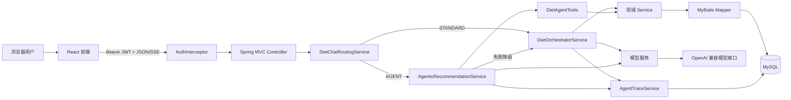
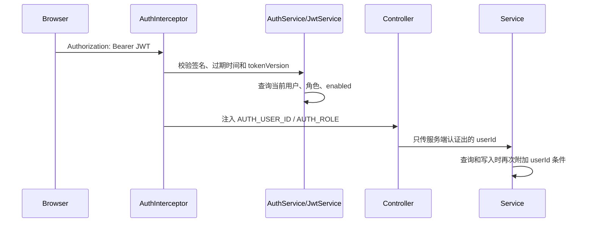
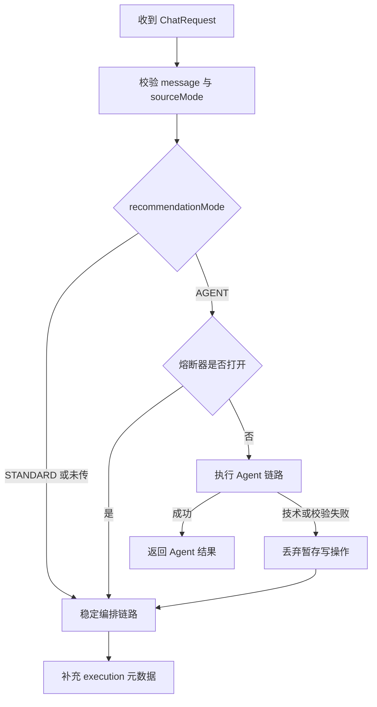
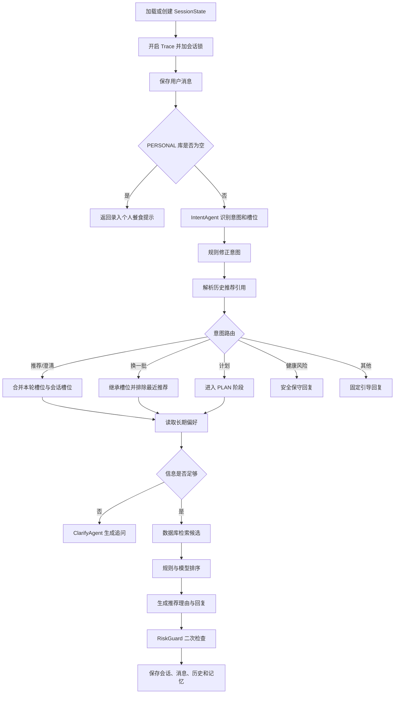
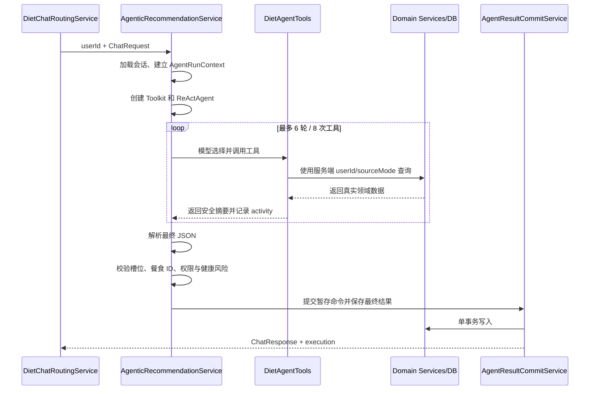
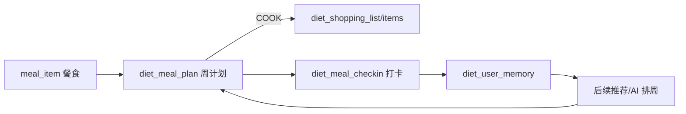

# 食刻（diet-agent）项目架构与核心链路

本文档面向需要理解、维护或继续扩展本项目的开发者，描述当前代码中的整体架构、核心业务链路、数据模型、安全边界，以及各模块对应的代码位置。

## 1. 项目定位

食刻是一个前后端分离的日常饮食助手。它不只回答“今天吃什么”，还将推荐结果连接到一周计划、购物清单、执行打卡、长期记忆和每周复盘，形成如下闭环：

```text
自然语言推荐
    ↓
加入一周计划
    ↓
生成购物清单 / 查看外食建议
    ↓
今日执行与打卡
    ↓
反馈进入长期记忆
    ↓
影响后续推荐和下周计划
```

推荐能力包含两条链路：

- `STANDARD`：稳定、确定的固定编排链路。
- `AGENT`：使用 ReAct Agent 和受控站内工具的智能链路；失败时自动降级到 `STANDARD`。

## 2. 技术栈

| 层级 | 技术 |
| --- | --- |
| 前端 | React、TypeScript、Vite、React Router、Lucide React |
| 后端 | Spring Boot 3、Java、MyBatis |
| Agent | AgentScope Java 1.0.11、ReActAgent、Toolkit |
| 数据库 | MySQL 8；测试使用 H2 |
| 鉴权 | JWT Bearer Token、BCrypt |
| 通信 | JSON HTTP API、SSE 流式响应 |
| 测试 | JUnit 5、Mockito、Spring MockMvc、Vitest、Testing Library、jsdom |

依赖声明位于：

- 后端：[pom.xml](../diet-agent/pom.xml)
- 前端：[package.json](../diet-web/package.json)

## 3. 仓库结构

```text
diet-agent/
├─ diet-agent/                       Spring Boot 后端
│  ├─ src/main/java/com/diet/
│  │  ├─ controller/                 HTTP 接口层
│  │  ├─ service/                    业务与 Agent 编排层
│  │  ├─ agent/                      固定链路 Agent 构造器和工厂
│  │  ├─ mapper/                     MyBatis Mapper 接口
│  │  ├─ model/                      请求、响应、数据库行和领域模型
│  │  ├─ enums/                      业务枚举
│  │  ├─ config/                     JWT、CORS、管理员权限等配置
│  │  └─ util/                       JSON 与槽位工具
│  └─ src/main/resources/
│     ├─ mapper/                     MyBatis SQL XML
│     ├─ diet/prompts/               Agent 提示词
│     └─ db/                         完整建库脚本与增量迁移
├─ diet-web/                         React 前端
│  └─ src/
│     ├─ pages/                      页面
│     ├─ components/                 通用组件
│     ├─ lib/                        API 与认证上下文
│     ├─ types.ts                    前端领域类型
│     └─ styles.css                  全局样式
├─ docs/                             项目文档与设计素材
└─ README.md                         启动和使用说明
```

## 4. 总体架构



主要入口：

- 后端启动类：[DietApplication.java](../diet-agent/src/main/java/com/diet/DietApplication.java)
- 前端路由：[App.tsx](../diet-web/src/App.tsx)
- API 封装：[api.ts](../diet-web/src/lib/api.ts)
- 对话 HTTP 入口：[DietChatController.java](../diet-agent/src/main/java/com/diet/controller/chat/DietChatController.java)

## 5. 请求身份与权限链路

除注册和登录外，业务接口都使用 JWT 获取当前用户身份，不接受前端自行声明 `userId`。



对应代码：

- JWT 生成与校验：[JwtService.java](../diet-agent/src/main/java/com/diet/service/auth/JwtService.java)
- 注册、登录、注销和用户校验：[AuthService.java](../diet-agent/src/main/java/com/diet/service/auth/AuthService.java)
- 请求拦截：[AuthInterceptor.java](../diet-agent/src/main/java/com/diet/config/AuthInterceptor.java)
- MVC 注册：[AuthMvcConfig.java](../diet-agent/src/main/java/com/diet/config/AuthMvcConfig.java)
- 管理员注解：[AdminOnly.java](../diet-agent/src/main/java/com/diet/config/AdminOnly.java)
- 前端登录态：[AuthContext.tsx](../diet-web/src/lib/AuthContext.tsx)

权限规则：

- 普通用户只能操作自己的个人餐食、计划、购物清单、记忆、收藏和打卡。
- 公共餐食对普通用户只读，只有管理员可以单条或批量维护。
- 模型配置、运行记录和离线评测只对管理员开放。
- Agent 工具中的 `userId` 和 `sourceMode` 由服务端上下文注入，不允许模型传入。

## 6. 对话协议与统一路由

同步和流式接口分别是：

- `POST /api/v1/diet/chat`
- `POST /api/v1/diet/chat/stream`

请求结构定义在 [ChatRequest.java](../diet-agent/src/main/java/com/diet/model/ChatRequest.java)：

```json
{
  "sessionId": "可选",
  "message": "推荐一道适合明天午餐的菜并加入计划",
  "sourceMode": "PUBLIC",
  "recommendationMode": "AGENT",
  "context": {}
}
```

其中：

- `sourceMode`：`PERSONAL` 或 `PUBLIC`，是严格数据源边界。
- `recommendationMode`：`STANDARD` 或 `AGENT`；省略时默认为 `STANDARD`。
- 同一会话可以在两种推荐模式之间切换。

统一路由由 [DietChatRoutingService.java](../diet-agent/src/main/java/com/diet/service/orchestrator/DietChatRoutingService.java) 完成：



路由的具体步骤：

1. 校验 `message` 非空、`sourceMode` 非空，否则抛 `DietException`。
2. `recommendationMode` 为空时按 `STANDARD` 处理。
3. `STANDARD` → 直接调用稳定链路，并附加 `ChatExecution.standard(...)`。
4. `AGENT` → 先按 `userId::sessionId` 取会话锁（`sessionLocks`），保证同一会话串行，然后判断熔断器：
   - 熔断打开 → 推送降级提示，直接走稳定链路，降级码 `AGENT_CIRCUIT_OPEN`。
   - 熔断关闭 → 调用 Agent 链路；成功调用 `recordSuccess()` 重置熔断。
5. Agent 抛出 [AgentRunException.java](../diet-agent/src/main/java/com/diet/service/agentic/AgentRunException.java) 时：
   - 若错误码属于基础设施类（`MODEL_ERROR`、`AGENT_TIMEOUT`、`TOOL_ERROR`、`TOOL_CALL_UNSUPPORTED`），累加熔断计数（连续 3 次打开 60 秒）。
   - 无论何种错误码都降级到稳定链路，并把 `actualMode` 记为 `STANDARD`、`fallbackOccurred` 记为 `true`。
6. 降级时若本轮存在明确写操作（`mutationRequested`），追加一条 `NOT_COMMITTED` 活动，明确告知"写操作没有执行"。

响应中的执行信息定义在 [ChatExecution.java](../diet-agent/src/main/java/com/diet/model/ChatExecution.java)：

```json
{
  "requestedMode": "AGENT",
  "actualMode": "STANDARD",
  "fallbackOccurred": true,
  "fallbackCode": "AGENT_TIMEOUT",
  "activities": [],
  "mutationsCommitted": false
}
```

SSE 事件定义在 [ChatStreamEvent.java](../diet-agent/src/main/java/com/diet/model/ChatStreamEvent.java)，事件顺序通常为：

```text
status → activity（0~N 次）→ status（可能为降级提示）→ delta（0~N 次）→ complete
```

异常时发送 `error`。

## 7. STANDARD 稳定推荐链路

稳定链路入口是 [DietOrchestratorService.java](../diet-agent/src/main/java/com/diet/service/orchestrator/DietOrchestratorService.java) 的 `dietChat`。



### 7.1 意图识别

- 模型识别：[IntentAgentService.java](../diet-agent/src/main/java/com/diet/service/intent/IntentAgentService.java)
- 规则修正：[IntentReviseService.java](../diet-agent/src/main/java/com/diet/service/intent/IntentReviseService.java)
- Agent 构造：[IntentAgentBuilder.java](../diet-agent/src/main/java/com/diet/agent/builder/IntentAgentBuilder.java)
- 提示词：[intent.txt](../diet-agent/src/main/resources/diet/prompts/intent.txt)

主要意图定义在 [Intent.java](../diet-agent/src/main/java/com/diet/enums/Intent.java)，包括推荐、澄清、调整、计划、健康风险和其他。

#### 步骤 1：组装输入

`IntentAgentService.recognize` 把以下内容拼成一段文本发给 IntentAgent（轻量模型）：

```text
userId: ...
sessionId: ...
recentHistory: 最近 3 轮对话摘要
knownSlots: 会话里已累积的槽位
slotOptions: 从 diet_slot_option 读出的 7 维合法候选值
当前这一句: 用户本轮原话
请输出 JSON，字段为 intent、slots、confidence。
slots 必须从 slotOptions 对应字段的候选值中选择；无法映射则输出 null 或空数组，不要创造标签。
```

调用前会执行 `agent.getMemory().clear()`，避免上一轮对话污染本轮分类。

#### 步骤 2：解析模型输出

`parseResult` 做三件事，且**只接受字典内的标签**：

1. `llmJsonService.parseObject` 提取 JSON（兼容被 markdown 代码块包裹的情况）。
2. `Intent.valueOf(...)` 解析意图枚举；非法枚举名不是抛错，而是转关键词兜底。
3. `SlotJsonPicker.pick(node, 字段名, slotOptions)` 逐维抽取槽位，**候选值不在字典里的标签会被直接丢弃**。

`slots` 既支持嵌套对象（`{"slots":{...}}`），也兼容扁平 JSON。`confidence` 缺省为 `0.5`。

#### 步骤 3：失败兜底（不抛异常）

模型超时、报错或 JSON 不可解析时，`recognize` 进入 `fallback`：

- 意图由关键词规则推断（`fallbackIntent`）。
- 槽位置空（`SlotBundle.empty()`）。
- 置信度固定 `0.2`。

关键词推断的优先级顺序是**从上到下第一个命中即返回**：

| 优先级 | 命中关键词 | 结果意图 |
| --- | --- | --- |
| 1 | 空输入 | `CLARIFY_NEEDED` |
| 2 | 胃疼、糖尿病、孕妇、未成年人、治好、治疗、极端节食、绝食 | `HEALTH_RISK` |
| 3 | 换一批、换个、不要太油、清淡点、便宜点、快一点 | `MEAL_ADJUST` |
| 4 | 三餐、早中晚、一周 | `MEAL_PLAN` |
| 5 | 你是谁、你是 AI、你好 | `OTHER` |
| 6 | 吃什么、推荐、晚饭、午饭、早餐、想吃 | `MEAL_RECOMMENDATION` |
| 默认 | 其他 | `CLARIFY_NEEDED` |

#### 步骤 4：规则二次矫正（IntentReviseService）

模型结果不直接使用，`revise(state, result, userInput)` 会按顺序套用三条规则，**先命中先返回**：

| 顺序 | 条件 | 矫正结果 | 目的 |
| --- | --- | --- | --- |
| 规则一 | 意图已是 `HEALTH_RISK`，**或**用户输入命中健康风险关键词 | 强制 `HEALTH_RISK` | 安全优先，不受置信度影响 |
| 规则二 | 意图是 `MEAL_ADJUST` 但 `state.lastRecommendations` 为空 | 降级为 `MEAL_RECOMMENDATION` | 没有可排除对象时“换一批”无意义 |
| 规则三 | 意图是 `MEAL_RECOMMENDATION` 且 `confidence < 0.4` | 降级为 `CLARIFY_NEEDED` | 低确定性不直接进入检索 |

规则一的关键词比兜底更严格：`胃疼、糖尿病、孕妇、未成年人、儿童、高血压、治好、治疗、诊断、处方、极端节食、绝食、一天不吃、只喝水`。

`LOW_CONFIDENCE_THRESHOLD = 0.4` 定义在 `IntentReviseService`，是"模型有多确信才允许直接推荐"的阈值。

### 7.2 槽位与澄清

餐食需求统一表示为 `SlotBundle`，包含 7 个维度（每个维度是**字符串列表**，允许一格多值，例如 `healthGoal = [清淡, 高蛋白]`）：

| 字段 | 含义 | 候选值示例（来自 `diet_slot_option`） |
| --- | --- | --- |
| `mealTime` | 餐次 | 早餐、早午餐、午餐、下午茶、晚餐、夜宵、加餐、三餐 |
| `mood` | 情绪/身体状态 | 疲惫、烦躁、开心、焦虑、没胃口、压力大、想放松 |
| `scene` | 使用场景 | 工作、校园、家里、加班、运动后、通勤、聚餐、独处 |
| `healthGoal` | 健康目标 | 减脂、清淡、养胃、高蛋白、均衡、低油、低盐、控碳水 |
| `cuisine` | 菜系 | 川菜、粤菜、湘菜、江浙菜、轻食、西餐、日料、家常 |
| `taste` | 口味 | 清淡、辣、微辣、麻辣、酸甜、咸鲜、奶香 |
| `convenience` | 便捷性 | 快速、慢享、外带方便、一人食、少排队、适合备餐 |

对应代码：

- 槽位模型：[SlotBundle.java](../diet-agent/src/main/java/com/diet/model/SlotBundle.java)
- 多轮合并：[SlotMergeService.java](../diet-agent/src/main/java/com/diet/service/slot/SlotMergeService.java)
- 合法值校验：[SlotOptionService.java](../diet-agent/src/main/java/com/diet/service/slot/SlotOptionService.java)
- 规则判断：[ClarifyRuleService.java](../diet-agent/src/main/java/com/diet/service/clarify/ClarifyRuleService.java)
- 澄清回复：[ClarifyAgentService.java](../diet-agent/src/main/java/com/diet/service/clarify/ClarifyAgentService.java)

#### 步骤 1：合并多轮槽位（SlotMergeService）

合并规则是**逐字段独立判断，本轮非空则覆盖历史，本轮为空则保留历史**：

```java
choose(history, current) = (current == null || current.isEmpty()) ? history : current
```

含义：

- 用户本轮说"晚餐"，`mealTime` 覆盖为 `[晚餐]`，其他维度沿用历史。
- 用户本轮只回答"减脂"，则 `healthGoal` 覆盖，`mealTime` 仍保留上一轮说的"午餐"。
- **本轮不会把历史槽位"清空"**，因此多轮对话是"逐步补齐"而非"每轮重来"。

#### 步骤 2：长期偏好补全（UserMemoryService.personalize）

在进入澄清判断前，会先把长期偏好补进**空字段**（详见 7.4）：`personalize` 只填空、不覆盖本轮已明确的维度，且每个维度最多补入 1 个最强偏好。

#### 步骤 3：规则层决定 ASK / READY（ClarifyRuleService）

**是否追问由 Java 规则决定，不由模型决定。** 核心方法 `missingSlots(slots)` 的完整逻辑是：

| 判断顺序 | 条件 | 是否计入缺失 |
| --- | --- | --- |
| 1 | `mealTime` 为空 | **一定缺失**（餐次是硬必填） |
| 2 | `healthGoal` 为空 **且** `cuisine`、`taste`、`scene`、`convenience` **全部为空** | **缺失 `healthGoal`** |
| 3 | `healthGoal` 为空，但四个维度中有任意一个非空 | 不缺失 |

换句话说：

- **餐次永远要问**：不知道早/午/晚就无法推荐。
- **健康目标只有在"用户什么都没说"时才问**：只要用户给了菜系、口味、场景或便捷性中任意一个信号，就不再追问健康目标——因为此时已有足够信息做检索。
- `mood` 和 `scene` **从不作为必填**，只是加分项。

`hasEnoughSlots(slots)` 即 `missingSlots(slots).isEmpty()`：

- 返回 `true` → 进入检索推荐链路。
- 返回 `false` → 进入澄清链路。

**示例对照**：

| 用户输入 | 合并后槽位 | 缺失 | 结论 |
| --- | --- | --- | --- |
| "推荐一下" | 全空 | `mealTime`,`healthGoal` | ASK |
| "午餐推荐一下" | `mealTime=[午餐]` | `healthGoal` | ASK |
| "午餐想吃辣的" | `mealTime=[午餐]`,`taste=[辣]` | 无 | READY |
| "想减脂" | `healthGoal=[减脂]` | `mealTime` | ASK |
| "午餐清淡点" | `mealTime=[午餐]`,`taste=[清淡]` | 无 | READY |

#### 步骤 4：模型层只负责"说人话"（ClarifyAgentService）

`decide(sessionId, userInput, slots)` 的分支：

1. `missingSlots` 为空 → 直接返回 `ClarifyResult.ready()`，**完全不调用 LLM**（省一次模型调用）。
2. `missingSlots` 非空 → 清空 ClarifyAgent 记忆 → 调用 ClarifyAgent（**轻量模型**），输入格式为：

   ```text
   用户原话：...
   已知信息：{SlotBundle}
   缺失字段：[mealTime, healthGoal]
   ```

   提示词要求"只输出一句自然追问，不要 JSON、不要标签"。
3. 模型返回空文本 → 用 `fallbackQuestion(missingSlots)` 模板兜底。
4. 模型抛异常 → 同样用模板兜底（`catch` 里返回 ASK），**保证用户一定能看到追问**。

`ClarifyAgentService` 永远不会向用户抛出异常，也不允许模型决定"要不要问"。

#### 步骤 5：模板兜底文案（fallbackQuestion）

按缺失字段选择，优先级从上到下：

| 条件 | 兜底文案 |
| --- | --- |
| `missingSlots` 为空 | 你这顿更想按口味来，还是按清淡、顶饱这类目标来？ |
| 含 `mealTime` | 这顿主要是早餐、午餐还是晚餐？ |
| 含 `healthGoal` | 这顿更想清淡点、顶饱点，还是按口味来？ |
| 其他 | 我再确认一下，你这顿最看重口味、健康目标还是方便快捷？ |

#### 步骤 6：澄清结果如何落地

当 `action == ASK` 时，Orchestrator 走 `completeAsk`：

1. `phase` 切换为 `SessionPhase.CLARIFY`，并 `sessionStateService.save(...)`。
2. 把追问文案写入 `diet_messages`，`role=assistant`，`intent=CLARIFY_NEEDED`。
3. 记录 Trace 事件 `CLARIFY_DECISION`（输入为合并槽位，输出为 `ClarifyResult`）。
4. 返回 `ChatResponse.clarify(sessionId, traceId, question, missingSlots)`，前端据此渲染追问气泡。
5. **本轮不写推荐历史、不进入检索**，避免"信息不足却给出结果"。

> 澄清与意图的关系：意图 `CLARIFY_NEEDED` 并不会直接返回追问，它和 `MEAL_RECOMMENDATION` 走同一条 `handleRecommendation` 分支，**最终是否追问仍由 `ClarifyRuleService` 的规则决定**。这保证"模型说该问"和"规则说该问"不会互相矛盾。

### 7.3 检索、排序与回复

- 餐食查询：[MealSearchService.java](../diet-agent/src/main/java/com/diet/service/meal/MealSearchService.java)
- 餐食排序：[MealRankService.java](../diet-agent/src/main/java/com/diet/service/meal/MealRankService.java)
- 推荐文本生成：[RecommendResponseAgentService.java](../diet-agent/src/main/java/com/diet/service/recommend/RecommendResponseAgentService.java)
- 健康风险检查：[RiskGuardService.java](../diet-agent/src/main/java/com/diet/service/risk/RiskGuardService.java)
- 餐食数据库服务：[MealService.java](../diet-agent/src/main/java/com/diet/service/meal/MealService.java)

模型只负责理解、排序建议和自然语言表达；最终展示的餐食卡片仍从数据库中的真实餐食生成。

#### 步骤 1：数据源校验与召回（MealSearchService → MealService.search）

`MealSearchService.search` 先做两道校验：

1. `sourceMode` 为空 → 抛 `DietException("sourceMode 不能为空")`。
2. `sourceMode == PERSONAL` 但 `userId` 为空 → 抛 `DietException("PERSONAL 模式必须提供 userId")`。

随后调用 `MealService.search`，由 [MealMapper.xml](../diet-agent/src/main/resources/mapper/MealMapper.xml) 执行 **MySQL `JSON_OVERLAPS` 检索**（最多 50 行）：

- 数据源隔离由 SQL 强制：`PERSONAL` 必须 `source_type='PERSONAL' AND owner_user_id=#{userId}`，`PUBLIC` 必须 `source_type='PUBLIC' AND owner_user_id IS NULL`，**两者不会混查**。
- 7 个维度各自一个条件，且**空槽位不参与过滤**：`(#{维度Json} = '[]' OR JSON_OVERLAPS(列名, #{维度Json}))`。
- 该层的语义是"**有交集就召回**"（OR 式宽松匹配），不做精细排序。

#### 步骤 2：排除集合（Orchestrator）

在检索前，Orchestrator 会合并两类排除 ID：

```java
effectiveExclude = 本轮 excludeMealIds（如"换一批"的历史推荐）
                 ∪ userMemoryService.dislikedMealIds(userId)（长期不喜欢的餐食）
```

注意：**排除过滤发生在 Rank 层而不是 Search 层**，Search 只负责召回。

#### 步骤 3：二次重排（MealRankService）

排序语义与召回不同：召回看"有没有交集"，排序看"**满足程度有多高**"。

```java
slotScore = Σ_{7 个维度} overlap(item[x], query[x]) / 7
overlap(itemValues, queryValues) = 命中的用户标签数 / 用户查询标签总数
```

处理流程：先 `filter` 掉 `excludeMealIds` 和 null，再算分，按 `matchScore` 降序，**取 top10**。

计算示例（`healthGoal` 维度）：

| 餐食 | 餐食的 healthGoal | 用户的 healthGoal | overlap |
| --- | --- | --- | --- |
| 鸡胸肉 | [清淡, 高蛋白] | [清淡, 高蛋白] | 2/2 = 1.0 |
| 猪肘 | [高蛋白] | [清淡, 高蛋白] | 1/2 = 0.5 |

即"用户提的标签被满足得越全，分越高"；用户没提的维度记为 0（`queryValues` 为空时直接返回 0），最终 7 维平均后归一化到 `[0,1]`。

#### 步骤 4：生成推荐理由与回复（RecommendResponseAgentService）

把 **top3 候选 + 用户原话 + 个性化槽位**交给 RecommendResponseAgent，返回两部分：

- `RecommendResult`：`recommendations`（餐食选项）与 `needDisclaimer` 标记。
- `ResponseResult`：`speechText`（口语化回复）、`displayBlocks`（前端卡片）、`nextAction`。

模型可以决定"怎么表达、主推哪一道"，但**卡片内容由服务端用数据库真实餐食重建**。

#### 步骤 5：合规二次检查（RiskGuardService）

LLM 回复生成后再扫一遍（用户原文 + 助手回复拼接后统一检测），命中任意规则即 `block`，并用 `conservativeMessage()` **整体替换** `speechText`：

| 规则 | 关键词 | 原因 |
| --- | --- | --- |
| 1 | 意图已是 `HEALTH_RISK` | 命中 HEALTH_RISK 意图 |
| 2 | 治好、治疗、诊断、药、处方 | 涉及医疗诊断或治疗承诺 |
| 3 | 绝食、一天不吃、只喝水、极端节食 | 涉及极端节食建议 |
| 4 | 保证、一定能瘦、最健康、包瘦 | 涉及绝对化健康承诺 |
| 5 | 孕妇、糖尿病、高血压、未成年人、儿童 | 涉及特殊人群或慢病风险 |

被拦截时会额外记录 `NUTRITION_GUARD_REWRITTEN` 事件，未拦截记录 `COMPLIANCE_GUARD_REWRITTEN`。

#### 步骤 6：空结果分支

`ranked.isEmpty()` 时按数据源给出不同引导文案，**不调用 RecommendResponseAgent**：

- `PERSONAL`：提示补充饭堂菜或切换到公共餐食数据。
- `PUBLIC`：提示补充餐次、口味或菜系。

#### 步骤 7：持久化顺序

命中推荐后按固定顺序落库（顺序本身也是事务外的可观测点）：

1. `SessionState.appendLastRecommendations(lastIds)` → `sessionStateService.save(...)`（累积排除，供下轮"换一批"）。
2. `sessionService.appendMessage(sessionId, "assistant", speechText, intent, traceId)`。
3. `recommendationHistoryService.record(...)`（写入真正展示给用户的推荐历史，含 traceId）。
4. 记录 `RESPONSE_READY` 事件并返回 `ChatResponse.answer(...)`。

### 7.4 长期记忆与历史引用

#### 长期记忆写入（UserMemoryService）

**只记忆相对稳定的偏好**，`mood`、`scene`、`mealTime` 属于当轮状态，不进入长期记忆：

```java
STABLE_SLOT_KEYS = { healthGoal, cuisine, taste, convenience }
```

| 触发场景 | 方法 | 写入内容 | `delta` | `source` |
| --- | --- | --- | --- | --- |
| 对话中明确说出偏好 | `rememberExplicitPreferences` | 上述 4 个稳定维度 | +1.0 | `CONVERSATION` |
| 点赞/收藏/接受 | `rememberFeedback` | 餐食本身 | +2.0 | `FEEDBACK` |
| 点赞/收藏/接受 | `rememberFeedback` | 该餐食的 4 个稳定标签 | +0.5 | `FEEDBACK` |
| 不喜欢/隐藏/跳过/拒绝 | `rememberFeedback` | 仅餐食本身 | -3.0 | `FEEDBACK` |
| 打卡跳过 或 评分 ≤ 2 | `rememberPlanOutcome` | 等价于 SKIP | -3.0 | `FEEDBACK` |
| 打卡评分 ≥ 4 | `rememberPlanOutcome` | 等价于 LIKE | +2.0 | `FEEDBACK` |
| 打卡原因码 | `rememberPlanOutcome` | `BEHAVIOR_CONSTRAINT` | +1.0 | `CHECKIN` |
| 用户在偏好页手工设置 | `replacePreferences` | 4 个稳定维度（先删后写） | +5.0 | `MANUAL` |

两个重要设计取舍：

- **负反馈只排除具体餐食，不扩散到标签。** 用户讨厌一道菜，不代表讨厌整个菜系，所以 `delta < 0` 时不写标签记忆。`dislikedMealIds` 直接读负向餐食记忆（最多 100 条）并去重，进入每轮的排除集合。
- **强度累加而非覆盖。** 同一偏好反复出现会不断累加 `strength`，配合 `source` 区分来源权重（手工 MANUAL 权重最高、对话次之、反馈最轻）。

#### 召回与个性化（personalize）

`personalize` 用 `recallTopSlots` 读取每类**最强的一条**正向槽位记忆，然后：

```java
chooseCurrent(current, recalled) = (current 非空) ? current : recalled
```

即**本轮明确条件永远优先于长期偏好**，长期偏好只用来补空位。

#### 历史引用解析（RecommendationHistoryService.resolveReference）

用于支持"上次那个类似的再来一道"。触发必须**同时满足**两组关键词：

- 指代过去：`上次`、`之前`、`刚才`、`刚刚`、`那个`
- 寻求相似：`类似`、`差不多`、`再推荐`、`再来`、`换一个`、`换一批`

命中后：取最近 10 条历史中**同 `sourceMode` 的第一条**，以它的 `meals[0]` 作为锚点，把锚点的餐食槽位作为本轮槽位、把该次推荐的全部餐食 ID 作为排除集合。

Orchestrator 收到引用后会强制改写意图：

```java
state = state.withSlots(reference.slots()).appendLastRecommendations(reference.excludeMealIds());
intent = new IntentResult(Intent.MEAL_ADJUST, intent.slots(), max(confidence, 0.9));
```

即"上次那个"等价于"基于上次场景，换一批"。

## 8. AGENT 智能推荐链路

Agent 链路入口是 [AgenticRecommendationService.java](../diet-agent/src/main/java/com/diet/service/agentic/AgenticRecommendationService.java)。每轮请求都会创建一个独立 `ReActAgent`：

- 使用主模型。
- `maxIters = 6`。
- 默认总超时 20 秒，可通过 `diet.agentic.timeout-seconds` 调整。
- 单轮最多调用 8 次工具。
- 最终只接受结构化 JSON。

系统提示词位于 [agentic-recommendation.txt](../diet-agent/src/main/resources/diet/prompts/agentic-recommendation.txt)。

`execute` 的完整步骤：

1. `sessionStateService.loadOrCreate(...)` 加载或创建会话，生成本轮 `traceId`。
2. 创建 `AgentRunContext`（绑定 `userId`、`sourceMode`、用户原话、activity 回调）。
3. `openTrace(..., RecommendationMode.AGENT)`，记录 `AGENT_STARTED`。
4. 新建 `Toolkit` 并 `registerTool(toolsFactory.create(context))`——**工具实例与本轮上下文一一绑定**，因此工具里读到的永远是本轮认证信息。
5. 构建 `ReActAgent`（主模型 + `maxIters(6)` + `InMemoryMemory` + 系统提示词）。
6. `traceService.callAgent(..., timeout)` 调用，超时/异常时先 `recordActivities`，再向上抛。
7. 调用后校验：
   - `context.limitExceeded()` → 抛"工具调用次数超过限制"。
   - `context.toolCallCount() == 0` → 抛 `TOOL_CALL_UNSUPPORTED`（模型没调用任何工具，说明不支持 tool calling 或没按规则走）。
8. `parseResult` 解析最终 JSON → `validateAndHydrate` 校验并回填餐食 → `guard` 合规检查。
9. `commitService.commit(...)` 在**单事务**内提交暂存写命令 + 会话 + 消息 + 历史 + 记忆；若存在写命令再记录 `ACTION_COMMITTED`。
10. `markExecution(AGENT, null, toolCallCount)` 并返回带 `ChatExecution` 的响应。

失败路径统一抛 `AgentRunException`，其中会 `markExecution(STANDARD, code, ...)` 并记录 `AGENT_FALLBACK`。



### 8.1 Agent 工具

工具集中定义在 [DietAgentTools.java](../diet-agent/src/main/java/com/diet/service/agentic/DietAgentTools.java)，由 [DietAgentToolsFactory.java](../diet-agent/src/main/java/com/diet/service/agentic/DietAgentToolsFactory.java) 注入本轮上下文。

| 工具 | 类型 | 作用 |
| --- | --- | --- |
| `search_meals` | 只读 | 在当前数据源内按餐次、获取方式、耗时、价格等过滤餐食 |
| `get_meal_detail` | 只读 | 查看本轮已经检索到的餐食详情 |
| `get_user_diet_context` | 只读 | 读取长期偏好、行为约束和不喜欢的餐食 |
| `get_recent_recommendations` | 只读 | 查询近期推荐，减少重复 |
| `get_week_plan` | 只读 | 查看当前用户周计划 |
| `get_shopping_list` | 只读 | 查看当前用户购物清单 |
| `add_or_replace_plan_item` | 暂存写入 | 暂存加入或覆盖指定日期餐次的计划 |
| `replace_plan_item` | 暂存写入 | 暂存替换一个已有计划项 |
| `sync_shopping_list` | 暂存写入 | 暂存同步某周购物清单 |

工具安全上下文位于 [AgentRunContext.java](../diet-agent/src/main/java/com/diet/service/agentic/AgentRunContext.java)，负责：

- 保存认证后的 `userId` 和当前 `sourceMode`（**绝不作为工具参数暴露给模型**）。
- 统计工具调用次数：`MAX_TOOL_CALLS = 8`；每次调用前 `beginTool()` 自增，超过 8 次置 `limitExceeded = true` 并抛 `DietException`。
- 记录本轮真实检索过的餐食 ID（`retrievedMealIds`，`LinkedHashSet`）。
- 收集可以展示给前端的活动摘要，并通过 `activityConsumer` 实时推给 SSE。
- 保存尚未提交的写命令（`stagedMutations`）。

所有字段访问都带 `synchronized`，因为工具调用可能从不同线程进入。工具方法本身**不接受 `userId` 参数**，只能从 `context.userId()` 读取。

### 8.2 餐食 ID 防编造

Agent 返回餐食卡片前必须经过两层校验，缺一不可：

1. **来源校验**：ID 必须由本轮 `search_meals` 返回并记录在 `AgentRunContext`，`context.wasRetrieved(id)` 为 `false` 时抛 `UNVERIFIED_MEAL_ID`。
2. **权限与数据源校验**：`MealService.findAccessibleMeal(userId, id)` 必须同时满足"当前用户有权访问"且"`sourceType == 当前 sourceMode`"，否则同样抛 `UNVERIFIED_MEAL_ID`。

对应的失败语义合并在一处：

```java
if (!context.wasRetrieved(id)) throw failure("UNVERIFIED_MEAL_ID", "Agent 返回了未检索的餐食", ...);
MealItem meal = mealService.findAccessibleMeal(state.userId(), id);
if (meal == null || meal.sourceType() != state.sourceMode())
    throw failure("UNVERIFIED_MEAL_ID", "餐食不存在、越权或跨库", ...);
```

最终卡片由服务端从数据库重新构造，模型生成的名称、价格、食材或营养内容不会直接成为可信数据。**模型编造一个新 ID、或引用其他用户/其他数据源的餐食，都会导致本轮直接降级**，而不是把脏数据展示给用户。

### 8.3 写操作策略与事务提交

写操作权限不是只靠提示词控制。规则实现位于 [AgentMutationPolicy.java](../diet-agent/src/main/java/com/diet/service/agentic/AgentMutationPolicy.java)，判断前会先 `trim + toLowerCase` 归一化，然后要求**两组关键词同时命中**：

| 判断 | 条件 A（动作词） | 条件 B（对象词） |
| --- | --- | --- |
| `mayAddPlan` | 加入、添加、安排、放到、放进 | 计划、早餐、午餐、晚餐、加餐、今天、明天、周一~周日 |
| `mayReplacePlan` | 替换、换掉、换一道、换一个 | 计划、早餐、午餐、晚餐、加餐、这餐 |
| `maySyncShopping` | 同步、生成、更新、整理 | 购物清单、采购清单、买菜清单 |

`mutationRequested(input)` 是三者取或，用于降级时判断本轮是否存在"用户已明确要求、但因失败未执行"的写操作。

行为示例：

- “这道不错” → 只有评价，**不满足任何条件 A + B**，不会触发写入。
- “把它加入明天午餐计划” → `mayAddPlan` 命中 → 可以触发计划写入。
- “同步本周购物清单” → `maySyncShopping` 命中 → 可以触发清单同步。

即使策略放行，工具也**只暂存命令**，不直接写库。

Agent 工具只生成 [AgentMutation.java](../diet-agent/src/main/java/com/diet/service/agentic/AgentMutation.java) 中的待提交命令，不立即写数据库。

提交阶段：

- 命令执行：[AgentMutationCommitService.java](../diet-agent/src/main/java/com/diet/service/agentic/AgentMutationCommitService.java)
- 最终结果、会话、消息、历史和记忆提交：[AgentResultCommitService.java](../diet-agent/src/main/java/com/diet/service/agentic/AgentResultCommitService.java)

`AgentResultCommitService.commit` 使用事务；任何一步失败都会回滚。如果 Agent 在提交前超时、报错或输出非法，暂存命令会随本轮上下文直接丢弃。

### 8.4 降级与熔断

Agent 失败通过 [AgentRunException.java](../diet-agent/src/main/java/com/diet/service/agentic/AgentRunException.java) 携带：

- 降级代码。
- 已完成的安全活动摘要。
- 工具调用次数。
- 本轮是否包含明确写操作。

典型降级代码包括：

- `AGENT_TIMEOUT`
- `MODEL_ERROR`
- `TOOL_ERROR`
- `TOOL_CALL_UNSUPPORTED`
- `INVALID_OUTPUT`
- `UNVERIFIED_MEAL_ID`
- `POLICY_VIOLATION`
- `AGENT_CIRCUIT_OPEN`

熔断器实现位于 [AgentCircuitBreaker.java](../diet-agent/src/main/java/com/diet/service/agentic/AgentCircuitBreaker.java)：连续 3 次基础设施类失败后暂停 Agent 链路 60 秒；一次成功调用或模型配置更新会重置熔断状态。

降级时：

- 已暂存命令不提交。
- 稳定链路正常生成回复。
- 用户消息和最终助手消息只由稳定链路保存一次。
- 前端根据 `execution.fallbackOccurred` 和 `NOT_COMMITTED` 活动显示提示。

当前实现会分别保存失败的 Agent 尝试 Trace 和随后稳定链路的 Trace；两者可通过同一会话和相近时间定位。目前没有额外的 `parentTraceId` 字段。

## 9. 会话、推荐历史与长期记忆

### 9.1 会话状态

会话状态保存在 `diet_sessions`，消息保存在 `diet_messages`。

- 会话操作：[SessionService.java](../diet-agent/src/main/java/com/diet/service/session/SessionService.java)
- 状态加载与保存：[SessionStateService.java](../diet-agent/src/main/java/com/diet/service/session/SessionStateService.java)
- 状态模型：[SessionState.java](../diet-agent/src/main/java/com/diet/model/SessionState.java)
- 数据访问：[SessionMapper.xml](../diet-agent/src/main/resources/mapper/SessionMapper.xml)

`SessionState` 记录当前意图、阶段、已解析槽位、数据源和最近推荐 ID，使普通链路与 Agent 链路能够共享同一会话：

| 字段 | 类型 | 说明 |
| --- | --- | --- |
| `sessionId` | String | 前端多轮请求必须复用该值 |
| `userId` | Long | 用于 `PERSONAL` 数据源隔离 |
| `phase` | `SessionPhase` | 当前会话阶段，决定下一轮上下文如何被解释 |
| `sourceMode` | `SourceMode` | 会话绑定的数据源，禁止自动混查 |
| `currentIntent` | `Intent` | 当前或上一轮被确认的意图 |
| `slots` | `SlotBundle` | 多轮累积的 7 维槽位 |
| `lastRecommendations` | `List<Long>` | 本会话已推荐过的餐食 ID（累积），供"换一批"排除 |

`phase` 的主要取值与触发点：

| 阶段 | 进入时机 |
| --- | --- |
| `START` | 新会话创建（`SessionState.fresh`） |
| `CLARIFY` | 澄清追问返回时（`completeAsk`） |
| `RECOMMEND` | 槽位足够、进入推荐流水线前 |
| `PLAN` | 意图为 `MEAL_PLAN` 时 |

`SessionState` 是**不可变风格**的：所有变更都通过 `withPhase` / `withIntent` / `withSlots` / `appendLastRecommendations` 返回新实例，避免并发修改共享状态。其中 `appendLastRecommendations` 用 `LinkedHashSet` 做**去重且保持插入顺序**的累积追加。

### 9.2 推荐历史

真正展示给用户的推荐写入 `diet_recommendation_history`：

- 服务：[RecommendationHistoryService.java](../diet-agent/src/main/java/com/diet/service/history/RecommendationHistoryService.java)
- Controller：[RecommendationHistoryController.java](../diet-agent/src/main/java/com/diet/controller/history/RecommendationHistoryController.java)
- Mapper：[RecommendationHistoryMapper.xml](../diet-agent/src/main/resources/mapper/RecommendationHistoryMapper.xml)

历史不仅用于展示，也支持“上次那个”“类似的再来一道”等跨对话引用。

### 9.3 长期记忆

长期记忆保存在 `diet_user_memory`：

- 服务：[UserMemoryService.java](../diet-agent/src/main/java/com/diet/service/memory/UserMemoryService.java)
- Controller：[UserMemoryController.java](../diet-agent/src/main/java/com/diet/controller/memory/UserMemoryController.java)
- Mapper：[UserMemoryMapper.xml](../diet-agent/src/main/resources/mapper/UserMemoryMapper.xml)

记忆来源包括：

- 用户在对话中明确表达的口味、菜系、健康目标和便捷性要求（source=`CONVERSATION`）。
- 收藏与喜欢反馈（source=`FEEDBACK`）。
- 不喜欢和低评分反馈（source=`FEEDBACK`，只针对具体餐食）。
- 打卡、跳过及“太贵”“太费时间”“吃不饱”等原因（source=`CHECKIN`）。
- 用户在偏好页的手工设置（source=`MANUAL`，权重最高）。

记忆按 `memory_type + memory_key + memory_value` 维度做 **`strength` 累加**（不是覆盖），并保留 `source` 与 `evidence_count`，因此可以解释“这条偏好是几次什么行为积累出来的”。具体增量与来源见 [7.4 长期记忆与历史引用](#74-长期记忆与历史引用)。

推荐时的优先级：**本轮明确条件 > 长期偏好 > 无偏好**；明确不喜欢的餐食会进入排除集合。只有 `healthGoal`、`cuisine`、`taste`、`convenience` 四个稳定维度会进入长期记忆，`mealTime`、`mood`、`scene` 不长期保存。

## 10. 餐食、计划、购物和打卡闭环



### 10.1 餐食库

餐食由基础标签和详情两部分组成：

- 基础标签：餐次、场景、健康目标、菜系、口味、便捷性等。
- 详情：获取方式、预计耗时、难度、价格、默认份数、食材、步骤、外食建议、替换菜品和营养摘要。

代码位置：

- Controller：[MealController.java](../diet-agent/src/main/java/com/diet/controller/meal/MealController.java)
- Service：[MealService.java](../diet-agent/src/main/java/com/diet/service/meal/MealService.java)
- AI 补全与个人库扩展：[MealAiService.java](../diet-agent/src/main/java/com/diet/service/meal/MealAiService.java)
- 领域模型：[MealItem.java](../diet-agent/src/main/java/com/diet/model/MealItem.java)、[MealDetail.java](../diet-agent/src/main/java/com/diet/model/MealDetail.java)
- Mapper：[MealMapper.xml](../diet-agent/src/main/resources/mapper/MealMapper.xml)
- 前端餐食库：[MealsPage.tsx](../diet-web/src/pages/MealsPage.tsx)
- 前端详情页：[MealDetailPage.tsx](../diet-web/src/pages/MealDetailPage.tsx)

### 10.2 一周计划

计划以 `user_id + plan_date + meal_period` 唯一，同一用户同一天同一餐次只有一道主餐。保存时写入餐食快照，餐食库后续修改不会影响已经形成的历史计划。

- Controller：[MealPlanController.java](../diet-agent/src/main/java/com/diet/controller/plan/MealPlanController.java)
- Service：[MealPlanService.java](../diet-agent/src/main/java/com/diet/service/plan/MealPlanService.java)
- Mapper：[MealPlanMapper.xml](../diet-agent/src/main/resources/mapper/MealPlanMapper.xml)
- 前端：[PlanPage.tsx](../diet-web/src/pages/PlanPage.tsx)
- 加入计划弹窗：[AddToPlanDialog.tsx](../diet-web/src/components/AddToPlanDialog.tsx)
- 任意餐食选择：[MealPickerDialog.tsx](../diet-web/src/components/MealPickerDialog.tsx)

`MealPlanService` 同时负责：查询周计划、添加或覆盖、更新、删除、AI 排周、相似替换、打卡和周报统计。

### 10.3 购物清单

购物清单只聚合计划中获取方式为 `COOK` 的餐食：

- 相同食材且单位相同才合并。
- 不同单位不自动换算。
- 手工项和自动项分开处理。
- 重新同步自动项时不会删除手工项。

代码位置：

- Controller：[ShoppingListController.java](../diet-agent/src/main/java/com/diet/controller/shopping/ShoppingListController.java)
- Service：[ShoppingListService.java](../diet-agent/src/main/java/com/diet/service/shopping/ShoppingListService.java)
- Mapper：[ShoppingListMapper.xml](../diet-agent/src/main/resources/mapper/ShoppingListMapper.xml)
- 前端：[ShoppingPage.tsx](../diet-web/src/pages/ShoppingPage.tsx)

### 10.4 今日执行、打卡和周报

打卡写入 `diet_meal_checkin`，并更新计划状态：

- `PLANNED`
- `COMPLETED`
- `SKIPPED`
- `REPLACED`

评分、饱腹感、原因、实际餐食、实际花费和备注由 `MealPlanService.checkIn` 处理，同时调用 `UserMemoryService.rememberPlanOutcome` 更新长期行为约束。

周报由 `MealPlanService.weeklySummary` 统计完成率、做饭/外食比例、偏好标签、常见餐食和费用。

## 11. 收藏与反馈链路

推荐卡片上的行为通过以下服务进入长期画像：

- 收藏：[FavoriteMealService.java](../diet-agent/src/main/java/com/diet/service/favorite/FavoriteMealService.java)
- 推荐反馈：[FeedbackService.java](../diet-agent/src/main/java/com/diet/service/feedback/FeedbackService.java)
- 收藏接口：[FavoriteMealController.java](../diet-agent/src/main/java/com/diet/controller/favorite/FavoriteMealController.java)
- 反馈接口：[FeedbackController.java](../diet-agent/src/main/java/com/diet/controller/feedback/FeedbackController.java)

前端相关页面和组件：

- 首页推荐与今日执行：[ChatPage.tsx](../diet-web/src/pages/ChatPage.tsx)
- 收藏和历史：[CollectionPage.tsx](../diet-web/src/pages/CollectionPage.tsx)
- 长期偏好：[PreferencesPage.tsx](../diet-web/src/pages/PreferencesPage.tsx)
- 餐食卡片：[MealCard.tsx](../diet-web/src/components/MealCard.tsx)

## 12. 模型配置

模型配置保存在 `diet_model_config`，支持多个 OpenAI 兼容服务模板，也允许自定义 Base URL、Endpoint、主模型和轻量模型。

- Controller：[ModelConfigController.java](../diet-agent/src/main/java/com/diet/controller/model/ModelConfigController.java)
- Service：[ModelConfigService.java](../diet-agent/src/main/java/com/diet/service/model/ModelConfigService.java)
- Mapper：[ModelConfigMapper.xml](../diet-agent/src/main/resources/mapper/ModelConfigMapper.xml)
- 前端：[ModelSettingsPage.tsx](../diet-web/src/pages/ModelSettingsPage.tsx)

模型职责：

- 主模型：智能 Agent、主要推荐生成等复杂任务。
- 轻量模型：意图识别、澄清等较轻任务。

连接测试分两步：

1. 验证普通文本调用。
2. 注册一个临时 `diet_echo` 工具，验证模型是否能实际发起工具调用。

保存新配置会发布 [ModelConfigChangedEvent.java](../diet-agent/src/main/java/com/diet/service/model/ModelConfigChangedEvent.java)，清理固定 Agent 缓存并重置智能链路熔断器。

## 13. Trace、运行记录与评测

Trace 由 [AgentTraceService.java](../diet-agent/src/main/java/com/diet/service/trace/AgentTraceService.java) 记录到 `diet_request_trace`。

### 13.1 Trace 生命周期

Trace 使用 **ThreadLocal + `AutoCloseable` 作用域**，一次请求一条：

```text
openTrace(traceId, sessionId, userId, requestedMode)
    → 创建 TraceScope，绑定到当前线程 ThreadLocal
    → 返回 scope，由调用方用 try-with-resources 持有
        ├─ recordEvent(...)      记录状态机事件
        ├─ callAgent(...)        统一 LLM 调用包装，自动记录 AGENT_CALL 与 token
        └─ markExecution(...)    记录 actualMode / fallbackCode / toolCallCount
close()
    → flushTrace(this)  → INSERT diet_request_trace
    → finally currentScope.remove()   清除 ThreadLocal，避免线程池复用污染
```

三个关键实现细节：

1. **`record()` 在未开启 Trace 时静默跳过**（`scope == null` 直接 return），所以单元测试或未包裹的调用不会报错。
2. **落库失败只 `log.warn`**，绝不影响主业务返回——Trace 是旁路。
3. **`closed` 幂等标志**，防止重复 `close()` 造成重复 INSERT。

每条事件是内部 record `TraceEvent`：

| 字段 | 说明 |
| --- | --- |
| `stepOrder` | 事件全序号，`AtomicInteger` 自增，保证同一条 Trace 内可排序 |
| `eventType` | 事件类型，**是评测取数的契约** |
| `phase` | 阶段分组，供人阅读（HTTP/INTENT/SLOT/CLARIFY/SEARCH/RANK/GUARD…） |
| `agentName` / `modelName` | 仅 `AGENT_CALL` 有值 |
| `inputPayload` / `outputPayload` | 字符串原样 trim，对象走 JSON 序列化；**单条超过 20000 字符截断并追加 `...[truncated]`** |
| `latencyMs` | 耗时（毫秒） |
| `inputTokens` / `outputTokens` / `totalTokens` | 仅 `AGENT_CALL` 有值；**输入输出都取到才计算 total**，避免成本统计失真 |
| `errorMessage` | 非空时整条 Trace 被标记为 `FAILED` |

### 13.2 事件字典

| 阶段 | 事件类型 | 触发点 |
| --- | --- | --- |
| HTTP | `REQUEST_RECEIVED` / `REQUEST_FINISHED` / `REQUEST_FAILED` | Controller 进入、正常返回、异常 |
| SESSION | `USER_MESSAGE_RECORDED` | 用户消息写入 `diet_messages` |
| ROUTE | `PERSONAL_LIBRARY_EMPTY` / `ROUTE_SELECTED` | 个人库为空、意图分发 |
| INTENT | `INTENT_RECOGNIZED` / `INTENT_REVISED` | 模型原始输出、规则矫正后 |
| MEMORY | `HISTORY_REFERENCE_RESOLVED` / `LONG_TERM_MEMORY_RECALLED` / `LONG_TERM_MEMORY_APPLIED` | 历史引用、偏好召回、禁用餐食排除 |
| SLOT | `SLOTS_MERGED` | 多轮槽位合并结果 |
| CLARIFY | `CLARIFY_DECISION` | `ClarifyResult`（含 `action` 与 `missingSlots`） |
| ADJUST / PLAN | `ADJUST_CONTEXT_RESOLVED` / `PLAN_CONTEXT_RESOLVED` | 换一批、多餐规划上下文 |
| SEARCH | `MEAL_SEARCHED` | 候选数量与列表 |
| RANK | `MEAL_RANKED` | 重排后列表（评测的"合法卡片集合"） |
| RECOMMEND | `NO_MEAL_MATCHED` / `RECOMMEND_RESULT_BUILT` | 空结果、推荐结构 |
| RESPONSE | `RESPONSE_AGENT_RESULT` / `RESPONSE_READY` | 模型回复、最终响应 |
| GUARD | `NUTRITION_GUARD_CHECKED` / `NUTRITION_GUARD_REWRITTEN` / `COMPLIANCE_GUARD_REWRITTEN` | 合规检查与改写 |
| AGENT | `AGENT_STARTED` / `AGENT_CALL` / `TOOL_CALLED` / `TOOL_RESULT` / `ACTION_STAGED` / `ACTION_COMMITTED` / `AGENT_FALLBACK` | 智能链路 |

### 13.3 表结构与字段来源

重要字段：

- `requested_mode`：用户请求的推荐模式（来自 `openTrace`）。
- `actual_mode`：最终执行模式（来自 `markExecution`，降级后为 `STANDARD`）。
- `fallback_code`：降级原因（如 `AGENT_TIMEOUT`）。
- `tool_call_count`：工具调用数。
- `trace_json`：`{traceId, sessionId, userId, status, durationMs, events[]}` 有序事件列表。
- `duration_ms`：整条链路耗时。

**执行模式列的意义**：`requested_mode != actual_mode` 即发生降级，`fallback_code` 说明原因。前端运行记录页据此计算 Agent 成功率与降级率。

### 13.4 人工标注（Expected 标签）

`diet_request_trace` 中的三列是评测的监督信号：

| 列 | 含义 |
| --- | --- |
| `expected_intent` | 期望意图（gold intent） |
| `expected_slots` | 期望槽位（JSON） |
| `expected_clarify_action` | 期望澄清动作（`ASK` / `READY`） |

标注入口是 `PUT /api/v1/diet/debug/traces/{traceId}/label`，带 `user_id` 条件做越权校验；`findByTimeRange` 支持 `onlyUnlabeled` 过滤未标注数据。

> 注意：`updateLabel` 目前是**全量覆盖**（同时 SET 三列）。若只提交部分字段，其余列会被写为 `NULL`，调用方应始终提交完整标注。

### 13.5 离线评测（EvaluationService）

评测入口 `POST /api/v1/diet/evaluations`，只对管理员开放（`@AdminOnly`）。请求体为 [EvaluationRequest.java](../diet-agent/src/main/java/com/diet/model/EvaluationRequest.java)：`startAt`、`endAt`（左闭右开）、`includeLlmJudge`、`limit`。

流程：

```text
校验时间窗口
  → findByTimeRange 拉取 trace
  → loadFeedback：按 sessionId 去重后批量查推荐反馈
  → 逐条 evaluateTrace：
        parseTrace(trace_json.events) → TraceSnapshot
        → 规则指标 → （可选）LLM Judge → 用户反馈分 → 加权总分
  → EvaluationReport（总量、已标注数、平均分、分项平均、明细）
```

**TraceSnapshot 解析映射**（这是评测与 Trace 的耦合点）：

| 评估事实 | 来源事件 | 读取字段 |
| --- | --- | --- |
| 最终意图 | `INTENT_REVISED` / `ADJUST_CONTEXT_RESOLVED` | `intent`（调整链路强制为 `MEAL_ADJUST`） |
| 最终槽位 | `SLOTS_MERGED`（优先）/ `INTENT_REVISED` | `slots` |
| 澄清动作 | `CLARIFY_DECISION` | `action` |
| token 成本 | `AGENT_CALL` | `totalTokens` 累加 |
| 合法卡片集合 | `MEAL_RANKED` | `ranked[].id` |
| 展示卡片集合 | `RESPONSE_AGENT_RESULT` / `RESPONSE_READY` | `displayBlocks[].id` |
| 最终文本 | 同上 | `speechText` |
| 排除集合 | `ADJUST_CONTEXT_RESOLVED` | `excludeMealIds` |
| 是否失败 | 任意事件 `errorMessage` 或 `REQUEST_FAILED` 或 `status = FAILED` | — |

**指标矩阵**（缺失数据一律返回 `null`，不参与平均，不会被当作 0 分）：

| 类别 | 指标 | 计算方式 |
| --- | --- | --- |
| 标注依赖 | `intentAccuracy` | `expected_intent == 预测意图` → 1/0 |
| 标注依赖 | `slotAccuracy` | 只比较**被标注过**的槽位；用集合语义（忽略顺序、不忽略增删） |
| 标注依赖 | `clarifyNecessityAccuracy` | `expected_clarify_action == 实际 ASK/READY` → 1/0 |
| 规则/观测 | `costScore` | ≤1000 token 满分；≥3000 归零；中间 `(3000-x)/2000` |
| 规则/观测 | `latencyScore` | ≤3s 满分；≥8s 归零；中间 `(8000-x)/5000` |
| 规则/观测 | `fallbackScore` | 未降级 = 1，降级 = 0 |
| 规则/观测 | `safetyCompliance` | 最终文本不含治疗/保证类禁用短语 → 1 |
| 规则/观测 | `hallucinationControl` | 展示卡片 ID ⊆ `MEAL_RANKED` 候选 ID → 1 |
| 规则/观测 | `multiTurnConsistency` | 仅 `MEAL_ADJUST`：有排除集合且未命中排除项 → 1 |
| 原始观测 | `tokenCost` / `latencyMs` / `fallbackRate` | 仅展示，不直接进入规则分 |
| LLM Judge | `explanationQuality` / `naturalness` | 1–5 分，由 EvaluationJudgeAgent 给出 |
| 用户反馈 | `userFeedbackScore` | `rating/5`；或 `LIKE`=1、`SWITCH`=0.4、`DISLIKE`=0 |

**分数合成**：

```text
ruleScore    = 上述 9 个 0–1 规则指标的平均（跳过 null）
llmJudgeScore= (explanationQuality/5 + naturalness/5) / 2
总分         = (rule*0.6 + judge*0.1 + feedback*0.3) / 实际存在项的权重和
```

分母**动态归一**：某条 trace 未开 Judge 也无反馈时，只用规则分作为总分，不会因为"缺 40% 权重"被压低。最终统一转百分制输出。

**LLM Judge** 由 [EvaluationJudgeService.java](../diet-agent/src/main/java/com/diet/service/evaluation/EvaluationJudgeService.java) 调用 [evaluation-judge.txt](../diet-agent/src/main/resources/diet/prompts/evaluation-judge.txt)，只评 `explanationQuality` 与 `naturalness`；意图、槽位、安全、幻觉明确交给规则，**职责不重叠**。Judge 失败时返回 `null`，不阻塞整次评测。

**反馈归因现状**：`recommend_feedback` 目前没有 `traceId`，只能按 `sessionId` 近似归因——同一个 session 下的多条推荐 trace 会共享该 session 的全部反馈。

### 13.6 代码位置

- Trace Controller：[AgentTraceController.java](../diet-agent/src/main/java/com/diet/controller/trace/AgentTraceController.java)
- Trace Mapper：[AgentTraceMapper.xml](../diet-agent/src/main/resources/mapper/AgentTraceMapper.xml)
- 运行记录页面：[TracesPage.tsx](../diet-web/src/pages/TracesPage.tsx)
- 离线评测：[EvaluationService.java](../diet-agent/src/main/java/com/diet/service/evaluation/EvaluationService.java)
- LLM Judge：[EvaluationJudgeService.java](../diet-agent/src/main/java/com/diet/service/evaluation/EvaluationJudgeService.java)
- 评测页面：[EvaluationsPage.tsx](../diet-web/src/pages/EvaluationsPage.tsx)

运行记录页会区分 Agent 成功率、降级率、平均工具调用数，以及 Agent 和稳定链路的平均耗时。

> 当前评测报告**未按 `actual_mode` 分组**，因此无法直接量化"Agent 链路相对稳定链路的提升"。若需要横向对比，可在 `EvaluationService` 中按执行模式拆分 `metricAverages`。

## 14. 前端页面架构

前端路由统一定义在 [App.tsx](../diet-web/src/App.tsx)：

| 路由 | 页面 | 作用 |
| --- | --- | --- |
| `/` | `ChatPage` | 推荐对话、智能开关、今日计划、推荐历史和记忆摘要 |
| `/meals/personal` | `MealsPage` | 个人餐食库维护 |
| `/meals/public` | `MealsPage` | 公共餐食库；普通用户只读，管理员可维护 |
| `/meals/:id` | `MealDetailPage` | 餐食详情、食材步骤和加入计划 |
| `/collection` | `CollectionPage` | 收藏与推荐历史 |
| `/plan` | `PlanPage` | 周计划、替换、拖动、打卡和周报 |
| `/shopping` | `ShoppingPage` | 购物清单同步和手工维护 |
| `/preferences` | `PreferencesPage` | 长期偏好维护 |
| `/traces` | `TracesPage` | 管理员运行记录与人工标注 |
| `/evaluations` | `EvaluationsPage` | 管理员离线评测 |
| `/settings/models` | `ModelSettingsPage` | 管理员模型配置 |

对话页的智能模式状态保存在浏览器键 `diet.smart-recommendation.v1`。请求执行期间，数据源和智能模式开关都会被禁用，避免同一轮请求上下文发生变化。

## 15. 数据库表与代码映射

完整结构位于 [diet_db.sql](../diet-agent/src/main/resources/db/diet_db.sql)。

| 表 | 作用 | 主要 Mapper/Service |
| --- | --- | --- |
| `diet_user` | 用户、角色、令牌版本 | `DietUserMapper` / `AuthService` |
| `diet_sessions` | 会话状态 | `SessionMapper` / `SessionStateService` |
| `diet_messages` | 用户和助手消息 | `SessionMapper` / `SessionService` |
| `diet_request_trace` | 链路追踪和人工标注 | `AgentTraceMapper` / `AgentTraceService` |
| `diet_slot_option` | 合法槽位枚举 | `SlotOptionMapper` / `SlotOptionService` |
| `meal_item` | 公共和个人餐食 | `MealMapper` / `MealService` |
| `diet_model_config` | 模型服务配置 | `ModelConfigMapper` / `ModelConfigService` |
| `diet_recommendation_history` | 用户看到的推荐历史 | `RecommendationHistoryMapper` / `RecommendationHistoryService` |
| `diet_user_memory` | 长期偏好和行为约束 | `UserMemoryMapper` / `UserMemoryService` |
| `diet_favorite_meal` | 收藏 | `FavoriteMealMapper` / `FavoriteMealService` |
| `diet_meal_plan` | 周计划与餐食快照 | `MealPlanMapper` / `MealPlanService` |
| `diet_meal_checkin` | 计划执行打卡 | `MealPlanMapper` / `MealPlanService` |
| `diet_shopping_list` | 每周购物清单头 | `ShoppingListMapper` / `ShoppingListService` |
| `diet_shopping_item` | 自动和手工购物项 | `ShoppingListMapper` / `ShoppingListService` |
| `recommend_feedback` | 推荐喜欢/不喜欢反馈 | `FeedbackMapper` / `FeedbackService` |

已有数据库需要按时间顺序执行 `diet-agent/src/main/resources/db/migrations/` 中的迁移。双链路基础功能对应 [20260921_agentic_recommendation.sql](../diet-agent/src/main/resources/db/migrations/20260921_agentic_recommendation.sql)，Agent V2 的待确认操作、统一检索、Trace 元数据和会话摘要字段对应 [20260923_agentic_v2.sql](../diet-agent/src/main/resources/db/migrations/20260923_agentic_v2.sql)。

## 16. 主要 API 分组

所有业务 API 的统一前缀是 `/api/v1/diet`。

| 分组 | 主要接口 |
| --- | --- |
| 认证 | `/auth/register`、`/auth/login`、`/auth/me`、`/auth/logout` |
| 推荐 | `/chat`、`/chat/stream` |
| 餐食 | `/meals/personal`、`/meals/public`、`/meals/{id}`、`/meals/ai/complete` |
| 计划 | `/plans`、`/plans/items`、`/plans/generate`、`/plans/items/{id}/replace`、`/check-in` |
| 购物清单 | `/shopping-lists`、`/shopping-lists/sync`、`/shopping-lists/items` |
| 记忆与历史 | `/memories`、`/memories/preferences`、`/recommendations/history` |
| 收藏与反馈 | `/favorites`、`/feedback` |
| 模型配置 | `/model-config`、`/model-config/test` |
| 可观测性 | `/debug/traces`、`/evaluations` |

Controller 的完整列表位于 [controller](../diet-agent/src/main/java/com/diet/controller/)；前端调用封装位于 [api.ts](../diet-web/src/lib/api.ts)。

## 17. 测试结构

后端测试位于 [src/test/java](../diet-agent/src/test/java/)，主要覆盖：

- JWT 与角色权限。
- 用户数据隔离。
- 公共餐食批量事务。
- 推荐历史、收藏和长期记忆。
- 日常计划、购物清单和打卡 HTTP 集成。
- Agent 路由、自动降级和熔断。
- Agent 写操作意图判断、命令暂存和数据源隔离。

前端测试位于 `diet-web/src/__tests__/`：

- 登录、退出和管理员页面权限。
- API Bearer Token 与请求路径。
- 计划、打卡和购物清单交互。
- 餐食详情编辑器。
- 智能模式开关、请求协议、Agent 活动和降级提示。

运行命令：

```bash
cd diet-agent
mvn test

cd ../diet-web
npm test
npm run build
```

## 18. 扩展新功能时的落点

### 新增一个普通业务能力

建议依次增加：

1. `model` 中的请求、响应和行模型。
2. `mapper` 接口与 XML SQL。
3. `service` 中的事务和权限逻辑。
4. `controller` 中的 HTTP 接口。
5. `diet-web/src/types.ts` 和 `lib/api.ts`。
6. 对应页面或组件。
7. 后端权限/事务测试和前端交互测试。

### 新增一个 Agent 只读工具

1. 在 `DietAgentTools` 中添加带 `@Tool` 的方法。
2. 从 `AgentRunContext` 读取 `userId` 和 `sourceMode`，不要把它们暴露成模型参数。
3. 调用已有领域 Service，不直接执行任意 SQL。
4. 返回有限且结构化的数据，并记录安全的 `AgentActivity`。
5. 增加用户隔离、数据源隔离和调用次数测试。

### 新增一个 Agent 写工具

除上述步骤外，还必须：

1. 在 `AgentMutationPolicy` 中增加确定性的显式意图规则。
2. 在 `AgentMutation` 中定义待提交命令。
3. 工具阶段只调用 `context.stage`，禁止直接写库。
4. 在 `AgentMutationCommitService` 中加入事务提交分支。
5. 验证降级、超时和非法输出时不会留下部分数据。

## 19. 当前边界与注意事项

- Agent 第一版只允许调用站内饮食工具，不提供任意网络、文件、SQL 或 MCP 调用。
- `PERSONAL` 与 `PUBLIC` 是强约束，Agent 不会自行跨库。
- 价格和营养是可选估算值，不用于医疗诊断。
- 同一用户同一天同一餐次默认只有一道主餐。
- 购物清单不进行复杂单位换算。
- 家庭共享、地图、外卖、图片识别和库存管理尚未接入。
- 当前迁移由 SQL 文件手工执行，项目没有集成 Flyway/Liquibase 自动迁移。
- 模型 API Key 当前保存在服务端数据库中；生产环境建议增加 KMS 或应用层静态加密。
- Agent 降级会形成 Agent 尝试和稳定执行两条 Trace；如需严格的一请求一 Trace，可后续增加顶层 request trace 或 `parentTraceId`。

## 20. 快速阅读顺序

第一次阅读代码时，建议按以下顺序：

1. [App.tsx](../diet-web/src/App.tsx)：了解前端有哪些功能页面。
2. [ChatPage.tsx](../diet-web/src/pages/ChatPage.tsx)：了解主要用户入口和双链路协议。
3. [DietChatController.java](../diet-agent/src/main/java/com/diet/controller/chat/DietChatController.java)：查看 HTTP/SSE 入口。
4. [DietChatRoutingService.java](../diet-agent/src/main/java/com/diet/service/orchestrator/DietChatRoutingService.java)：理解 STANDARD/AGENT 路由和降级。
5. [DietOrchestratorService.java](../diet-agent/src/main/java/com/diet/service/orchestrator/DietOrchestratorService.java)：理解稳定推荐状态机。
6. [AgenticRecommendationService.java](../diet-agent/src/main/java/com/diet/service/agentic/AgenticRecommendationService.java)：理解 ReAct Agent 生命周期。
7. [DietAgentTools.java](../diet-agent/src/main/java/com/diet/service/agentic/DietAgentTools.java)：理解 Agent 能做什么以及安全边界。
8. [MealPlanService.java](../diet-agent/src/main/java/com/diet/service/plan/MealPlanService.java) 与 [ShoppingListService.java](../diet-agent/src/main/java/com/diet/service/shopping/ShoppingListService.java)：理解日常饮食闭环。
9. [UserMemoryService.java](../diet-agent/src/main/java/com/diet/service/memory/UserMemoryService.java)：理解长期记忆如何形成并影响推荐。
10. [diet_db.sql](../diet-agent/src/main/resources/db/diet_db.sql)：最后对照完整数据结构。
